# 九九カード の つかいかた

このページは、かけ算の 九九を れんしゅうする Web アプリ「九九カード」の つかいかたです。ほんものの 計算カードと おなじように、めくって、こたえを たしかめて、「できた」ものと「もういちど」やる ものに しわけます。がめんの しゃしんと 見くらべながら、上から じゅんに よんで ください。

## 九九カードで できること

九九カードは、かけ算の 九九を 3つの やりかたで れんしゅうして、その きろくを ふりかえる アプリです。ここでは、なにが できるのかと、はじめる まえに <ruby>用意<rt>ようい</rt></ruby>する ものを せつめいします。

### 九九カードは どんな アプリ？

ブラウザで ひらくだけで つかえる、九九の れんしゅう アプリです。アプリを ダウンロードしたり、名前や あいことばを つくったりする ことは ありません。ひらいた その ばで はじめられます。

れんしゅうの しかたは 3つ あります。カードを めくって しわける「カードでれんしゅう」、すうじの キーで こたえを 入れる「こたえてクイズ」、おともだちと かわりばんこに 出しあう「ふたりでもんだい」です。それに、じぶんの がんばりを 見る「きろく・スタンプ」を あわせて、はじめの がめんに 4つの ボタンが ならびます。

れんしゅうした きろくは、つかっている タブレットや パソコンの 中にだけ のこります。名前や しゅっせきばんごうを 入れる ところは 1つも ありません。インターネットの むこうへ おくる ことも ありません。

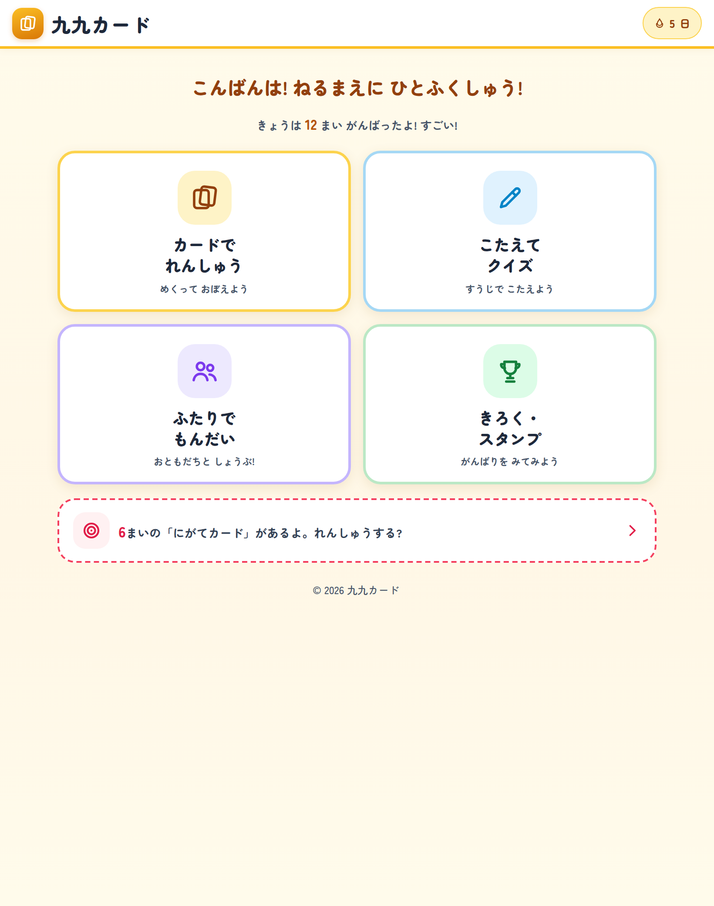

これが ひらいた ときの がめんです。

### つかう人と、はじめる まえに <ruby>用意<rt>ようい</rt></ruby>する もの

つかうのは、九九を おぼえる みなさんです。「先生むけ」と 書いて ある ところだけは、先生に よんで もらって ください。

はじめる まえに、つぎの ものが 手もとに あるか たしかめて ください。

1. タブレット・Chromebook・パソコンの どれか 1つ。スマートフォンでも つかえます。
2. インターネットに つながって いる こと。さいしょの 1回だけ ひつようです。
3. ひらく ところ（アドレス）… `https://kake-master.giga-school.com/`

ID や あいことばは いりません。アカウントを つくる ひつようも ありません。おともだちと きょうそうする「ふたりでもんだい」も、1台の タブレットを 2人で のぞきこんで あそぶので、もう1台 いる ことは ありません。

## はじめて ひらく ときに する こと（さいしょの 1回だけ）

さいしょの 1回だけ やって おく ことが 2つ あります。1つめは かならず、2つめは やらなくても つかえます。

### ブラウザで アドレスを ひらく

Chrome などの ブラウザを ひらいて、いちばん 上の アドレスの ところに つぎの ように 入れて、エンターキーを おして ください。

```
https://kake-master.giga-school.com/
```

すぐに ホームがめんが 出ます。名前を 入れたり、あいことばを 入れたり する ことは ありません。

さいしょの 1回は、かならず インターネットに つながった ところで ひらいて ください。その ときに アプリ ぜんぶが タブレットの 中に 入ります。つぎからは、つながって いなくても つかえます。

### ホームがめんに アプリとして 入れて おく（先生むけ）

タブレットの ホームがめんに 入れて おくと、ブラウザの バーが きえて がめんが 広く なり、つぎから すぐ ひらけます。入れかたは きかいに よって ちがいます。

1. Chromebook・Windows（Chrome / Edge）… がめんの 右上に 出る「インストール」を おします。出ない ときは、アドレスの ところの 右はしに ある 小さい しるしを おします。
2. iPad・iPhone（Safari）… <ruby>共有<rt>きょうゆう</rt></ruby>ボタン（□から ↑ が 出て いる しるし）を おして、下の ほうの「ホーム<ruby>画面<rt>がめん</rt></ruby>に<ruby>追加<rt>ついか</rt></ruby>」を おし、右上の「<ruby>追加<rt>ついか</rt></ruby>」を おします。
3. Android … メニューから「アプリをインストール」または「ホーム<ruby>画面<rt>がめん</rt></ruby>に<ruby>追加<rt>ついか</rt></ruby>」を おします。

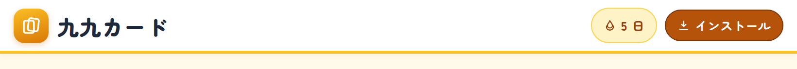

右の「インストール」が、入れられる ときだけ 出ます。

【！】おぼえて おいて ほしい こと

- 入れなくても、ブラウザの ままで ぜんぶ つかえます。
- 「インストール」の ボタンが 出ない ときは、もう 入って いるか、iPad の Safari で ひらいて いるか、まだ 1回も ふつうに ひらいて いないかの どれかです。
- iPad は、7日いじょう 1回も ひらかないと、のこした きろくが きえる ことが あります。ホームがめんに 入れて おくと、これが おきにくく なります。
- 入れても、きろくは その きかいの 中に のこった ままです。べつの きかいには うつりません。

## ホームがめんの みかた

ひらいた ときに 出る ホームがめんには、上の おび・まん中の 4つの ボタン・下の おしらせの 3つが あります。どこに 何が あるかを おぼえて おくと、まよわなく なります。

### いちばん 上の おびに ある もの

いちばん 上の おびには、左に「九九カード」の 名前、右に れんぞく日すうと「インストール」の ボタンが 出ます。

左の「九九カード」を おすと、ホームがめんに もどれます。せっていの がめんや きろくの がめんから、まちがえて 入った ときに つかって ください。れんしゅうの あいだは この おびが かくれるので、そのときは 左上の × を つかいます。

その 右の ほのおの しるしと すうじは、なん日 つづけて れんしゅうしたかです。きのうも きょうも れんしゅうして いない ときは、この しるしは 出ません。いちばん 右の「インストール」は、ホームがめんに 入れられる きかいで だけ 出ます。


左が ホームへ もどる ところ、右が れんぞく日すうです。

### まん中の 4つの ボタンで えらぶ

まん中には、大きな ボタンが 4つ ならんで います。上の 左から「カードでれんしゅう」「こたえてクイズ」、下の 左から「ふたりでもんだい」「きろく・スタンプ」です。

はじめの 3つは れんしゅうです。どれを おしても、まず おなじ せっていの がめんに いきます。4つめの「きろく・スタンプ」だけは、せっていを とおらずに そのまま きろくの がめんに いきます。

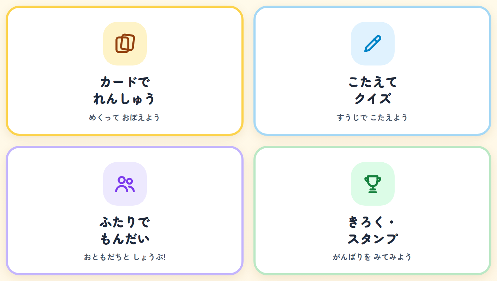

ボタンの 下に、なにを する ところかが 書いて あります。

### きょうの がんばりと「にがてカード」の おしらせ

いちばん 上の あいさつは、ひらいた 時こくで かわります。朝は「おはよう!」、ひるまは「こんにちは!」、夕がたから あとは「こんばんは!」です。その 下に、きょう なんまい めくったかが 出ます。まだ れんしゅうして いない 日は「きょうは まだ れんしゅうしていないよ。1まいから はじめよう!」と 出ます。

4つの ボタンの 下に、赤い わくの おしらせが 出る ことが あります。これは「にがてカード」が たまった ときだけ 出る もので、おすと その 場で にがてな 九九だけを れんしゅうできます。くわしくは にがてカードの ところに 書いて あります。

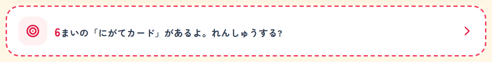

にがてカードが 0まいの ときは、この 行そのものが 出ません。

### 1つ前の がめんに もどる

がめんの 左上に「もどる」の ボタンが ある ときは、それを おすと 1つ前に もどります。れんしゅうの とちゅうは、左上の ×（やめる）で ホームに もどります。

タブレットや スマートフォンの「もどる」の うごき（下の バーの ボタンや、がめんの はしから 中へ すべらせる うごき）でも、1つ前に もどれます。パソコンでは キーボードの `Esc` が おなじ はたらきを します。

ホームがめんで この うごきを すると、下に「もう1回「もどる」で アプリを とじるよ」と 出ます。すぐに もう1回 すると アプリが とじます。とじたく ない ときは、そこで 何も しないで ください。

## れんしゅうを はじめる まえの せってい がめん

「カードでれんしゅう」「こたえてクイズ」「ふたりでもんだい」の 3つは、はじめる まえに おなじ せっていの がめんを とおります。いちばん 上に、いま えらんで いる れんしゅうの 名前が 出ます。

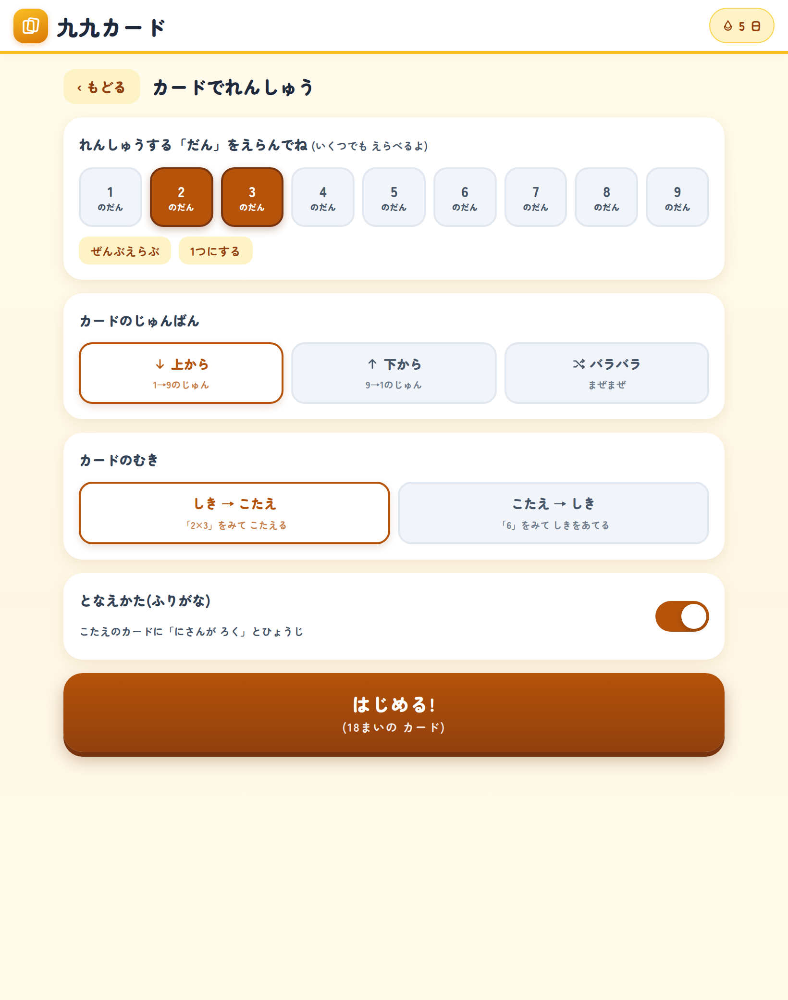

上から じゅんに えらんで、いちばん 下の「はじめる!」を おします。

### れんしゅうする「だん」を えらぶ

いちばん 上の「れんしゅうする「だん」をえらんでね」で、1のだんから 9のだんまでの 中から、やりたい だんを おします。おした だんは 色が つきます。もう1回 おすと 色が きえて、えらんで いない じょうたいに もどります。

いくつ えらんでも かまいません。2つ いじょう えらぶと、その ぜんぶが まざって 出ます。ただし、ぜんぶ けす ことは できません。1つも のこらなく なる ときは、下に「さいてい 1つは えらんでね」と 出て、えらんだ ままに なります。

右下の 2つの 小さい ボタンも つかえます。「ぜんぶえらぶ」は 1のだんから 9のだんまでの ぜんぶを えらびます。「1つにする」は、いま えらんで いる 中の いちばん 小さい だんだけを のこして、ほかを けします。

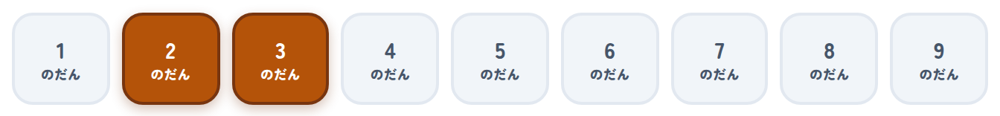

ここでは 2のだんと 3のだんを えらんで います。

### カードの じゅんばんを えらぶ

つぎの「カードのじゅんばん」で、カードの 出る じゅんばんを 3つの 中から えらびます。

1. 上から … えらんだ だんの 小さい ほうから、×1・×2・×3 …の じゅんに 出ます。
2. 下から … その ぎゃくで、大きい ほうの だんの ×9から さかのぼって 出ます。
3. バラバラ … 出る じゅんばんを まぜます。おぼえて きたら これに します。

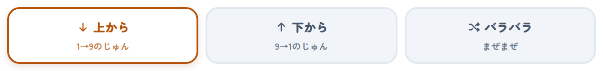

いま えらんで いる ものに 色が つきます。

### 「はじめる!」で まいすうを たしかめて はじめる

いちばん 下の 大きな ボタンで はじめます。ボタンの 中に、これから 出る カードの まいすうが 書いて あります。だんを 1つ えらぶと 9まい、2つ えらぶと 18まいです。

「こたえてクイズ」と「ふたりでもんだい」では、ここに 出るのは「もんだいのかず」で えらんだ かずです。えらんだ だんの カードより 大きい かずを えらんだ ときは、カードの まいすうの ほうが つかわれます。

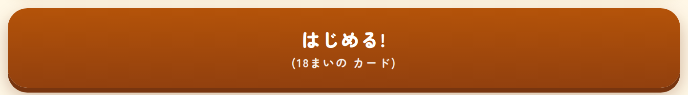

2つの だんを えらんだので「18まいの カード」と 出て います。

【！】おぼえて おいて ほしい こと

- おした その ばで はじまります。あとから だんを かえたい ときは、1回 やめて この がめんに もどって ください。
- れんしゅうの とちゅうで せっていを かえても、いま やって いる ぶんは かわりません。つぎに はじめた ときから かわります。

### えらんだ せっていは、つぎに ひらいた ときも のこる

えらんだ だん・じゅんばん・カードのむき・もんだいのかず・となえかたは、その きかいの 中に のこります。つぎの 日に ひらいても、まえと おなじ せっていから はじめられます。

のこるのは その きかいの 中だけです。べつの タブレットで ひらくと、また はじめの せっていに もどります。

## カードで れんしゅうする（めくって しわける）

ホームがめんの「カードでれんしゅう」から はじめます。ほんものの 計算カードと おなじで、しきを 見て、こたえを 思いうかべて、めくって たしかめて、できた ものと もういちど やる ものに しわけて いきます。

### カードを タップして こたえを 見る

まん中に 大きな カードが 1まい 出ます。おもてには 「2 × 1」の ような しきと、左上に「2のだん」、右上に「タップで こたえ」と 書いて あります。

こたえを 思いうかべてから、カードを タップして ください。カードが くるっと まわって、うらの こたえが 出ます。がめんの 下の まん中に ある「めくる」の ボタンでも おなじ ことが できます。

うらには、大きな こたえと、その 下に となえかた（「にいちが に」）が 出ます。となえかたは せっていで けす ことも できます。

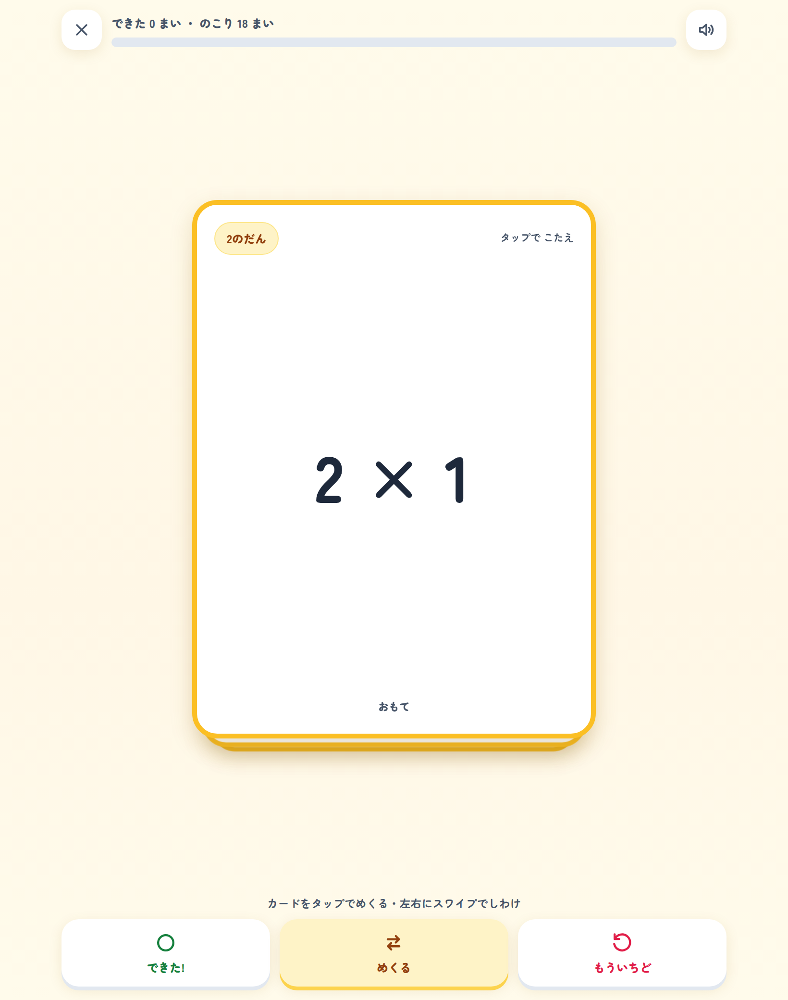

しきが 出て いる ほうが おもてです。

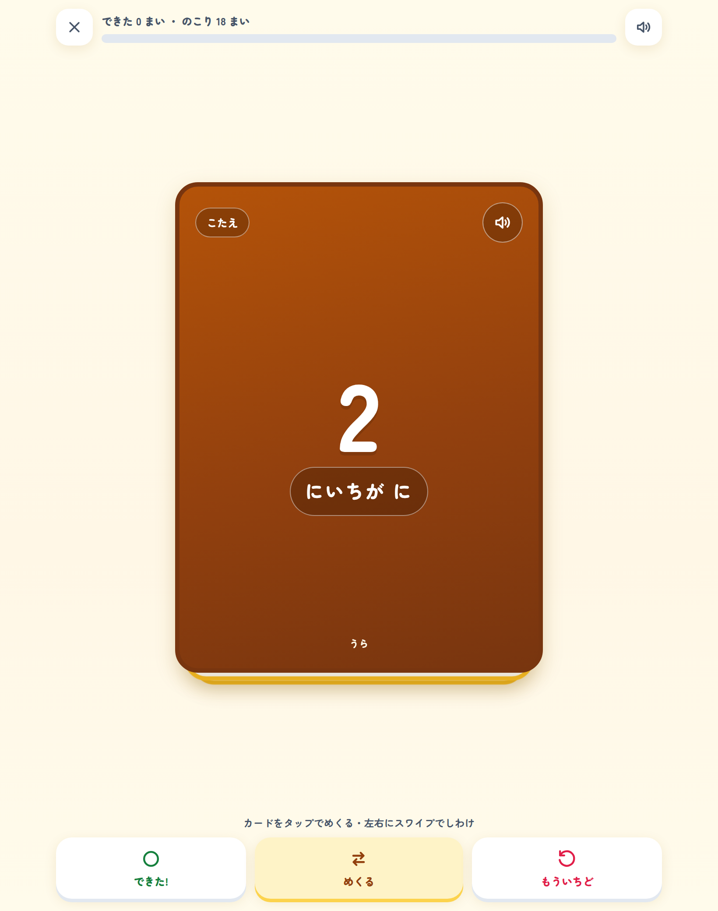

めくると こたえと となえかたが 出ます。

がめんの いちばん 上には、いま どこまで すすんだかが 出ます。「できた ○ まい・のこり ○ まい」の すうじと、その 下の ぼうが のびて いきます。

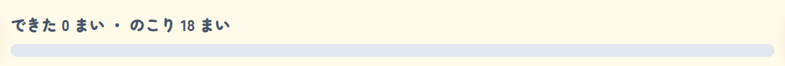

のこりが 0に なると おわりです。

### 「できた!」と「もういちど」に しわける

こたえを たしかめたら、その カードを「できた!」と「もういちど」の どちらかに しわけます。しわけかたは つぎの とおりです。

1. カードを 左へ すべらせる（スワイプ）と「できた!」の やまへ いきます。
2. カードを 右へ すべらせると「もういちど」に なります。
3. がめんの 下の「できた!」「もういちど」の ボタンを おしても おなじです。

よこへ すべらせて いくと、どちらに なるかの ふだが 出ます。そのまま 大きく すべらせて はなすと しわけられ、すこし しか うごかさずに はなすと、カードは もとの ところに もどります。

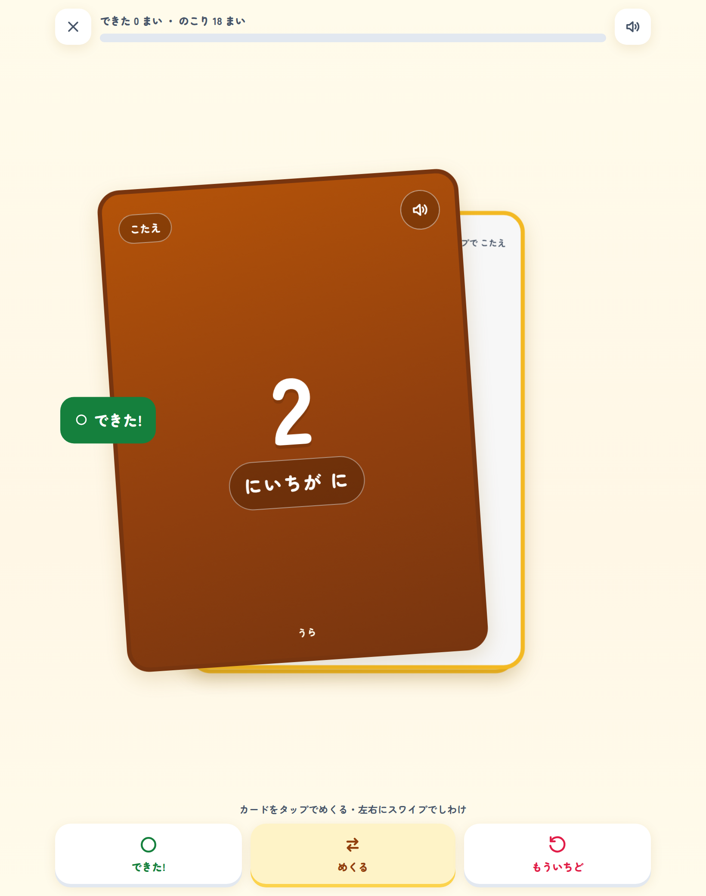

みどりの「できた!」の ふだが 出て います。

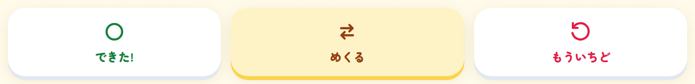

左から できた!・めくる・もういちど です。

「もういちど」に した カードは、やまの いちばん 下に もどって、あとで もう1回 出て きます。えらんだ カードが ぜんぶ「できた!」に なるまで おわりません。とちゅうで やめたい ときは、がめんの 左上の × を おして ください。

【！】おぼえて おいて ほしい こと

- こたえを 見ないで「できた!」に しても かまいません。じぶんで わかった ものは、めくらずに しわけて いくと はやく すすみます。
- 「もういちど」に した カードは、けっかの がめんで もういちど 見られます。
- とちゅうで やめても、そこまでの きろくは のこります。

### カードの むきを かえて、こたえから しきを 思い出す

せっていの がめんの「カードのむき」で、カードの おもてに 出る ものを かえられます。

1. しき → こたえ … しきを 見て、こたえを 思い出します。ふつうは こちらです。
2. こたえ → しき … こたえを 見て、その こたえに なる しきを 思い出します。

「こたえ → しき」を えらぶと、おもてに 大きな すうじが 出て、その 下に「こたえが 2 に なる しきは?」の ように 出ます。めくると しきと となえかたが 出ます。九九を ぎゃくから 思い出す れんしゅうに なります。

この せっていは「カードでれんしゅう」だけに あります。「こたえてクイズ」と「ふたりでもんだい」では 出ません。

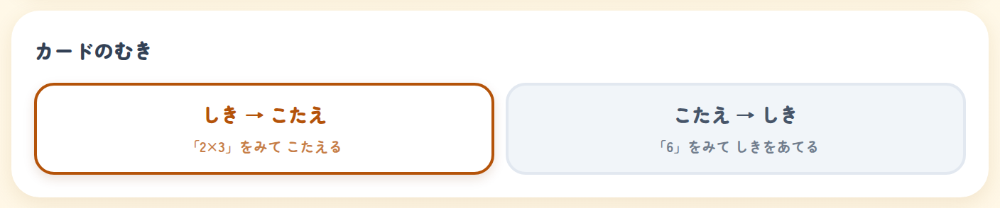

いま えらんで いる ほうに 色が つきます。

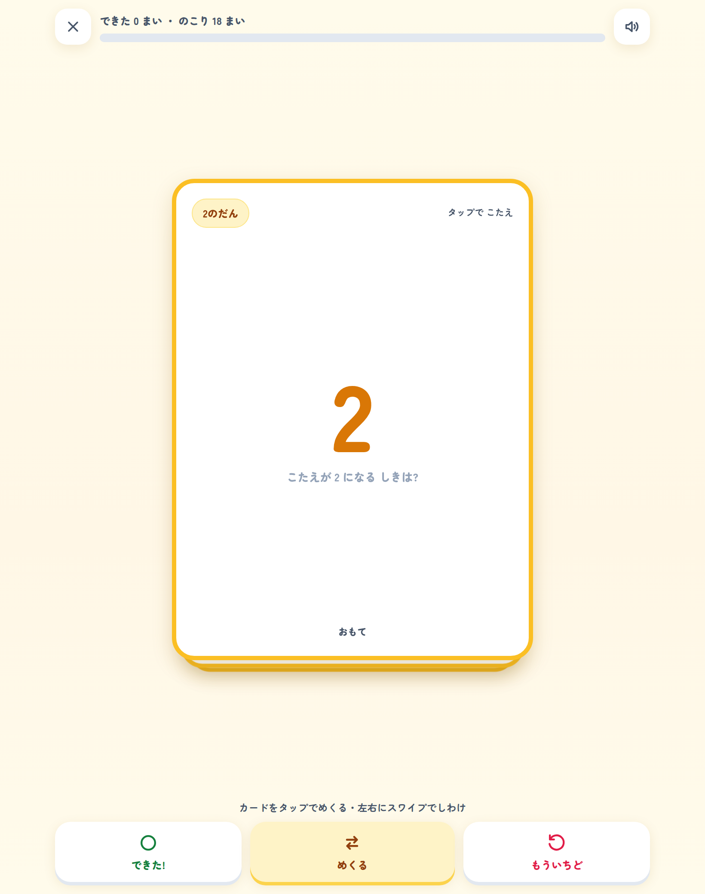

おもてに こたえが 出て、しきを あてます。

### となえかたの ふりがなと、よみあげの ボタン

せっていの がめんの、「はじめる!」の すぐ 上に「となえかた(ふりがな)」の スイッチが あります。オンに して おくと、カードの うらに「にいちが に」の ような となえかたが 出ます。オフに すると、こたえの すうじだけに なります。

この スイッチも「カードでれんしゅう」だけに あります。

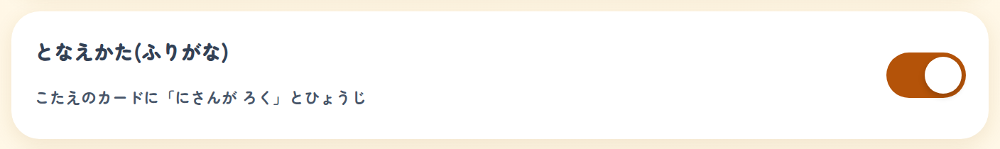

右の スイッチを おすたびに オンと オフが かわります。

カードの うらの 右上に ある 小さい スピーカーの ボタンを おすと、となえかたを こえで よんで くれます。ふりがなを けして いても、この ボタンは つかえます。カードを めくる つもりで おしても めくれないので、こえだけ ききたい ときに つかって ください。

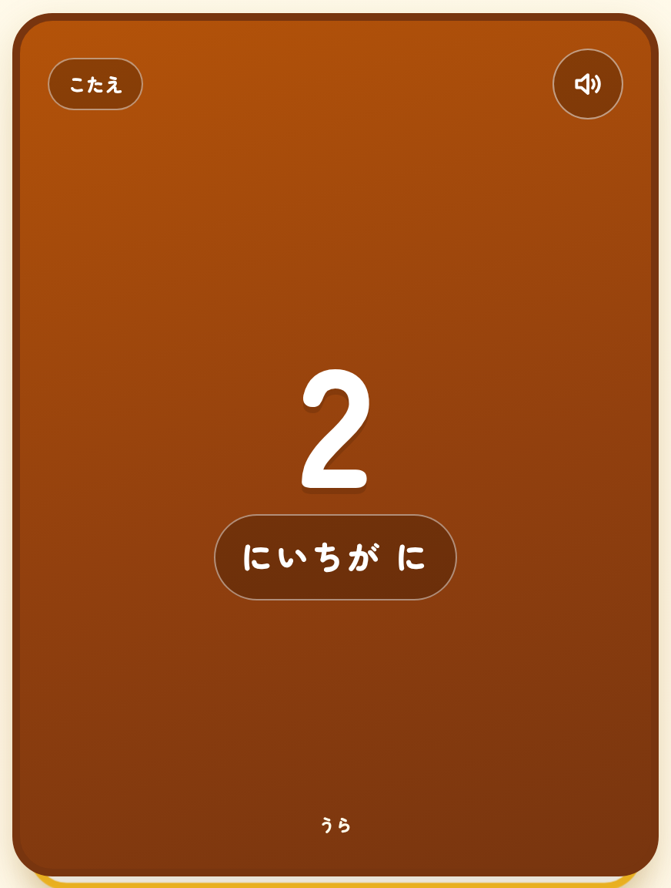

ここを おすと となえかたが きこえます。

### おとを 出す・けす と、キーボードで うごかす

れんしゅうの がめんの 右上に ある スピーカーの ボタンで、こうかおん（めくる 音や せいかいの 音）を 出す・けすが きりかえられます。おすと 下に「おとを オフにしたよ」と 出ます。この せっていは のこり、クイズと ふたりでもんだいの 音にも きいて きます。

上の となえかたの よみあげは、この ボタンでは けせません。となえかたを ききたく ない ときは、カードの スピーカーを おさなければ 鳴りません。

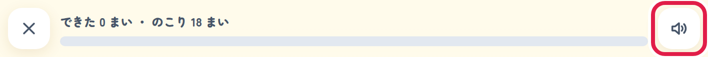

赤い わくの ところが おとの ボタンです。

キーボードの ある きかいでは、つぎの キーでも うごかせます。

1. 左むきの やじるし … できた!
2. 右むきの やじるし … もういちど
3. スペース・エンター・上むきの やじるし … カードを めくる
4. `Esc` … 1つ前の がめんに もどる

## こたえて クイズを する（すうじの キーで こたえる）

ホームがめんの「こたえてクイズ」から はじめます。がめんの すうじの キーで こたえを 入れて、あって いるかを その ばで たしかめる れんしゅうです。かかった 時間も はかります。

### すうじの キーで こたえを 入れて「OK」を おす

まん中に「2 × 1 = ?」の ような もんだいが 出ます。その 下の 白い はこが、こたえを 入れる ところです。

1. がめんの 下の すうじの キーを おします。こたえは 2けたまで 入れられます。
2. まちがえて おした ときは、左下の けしゴムの キーで 1つ けせます。
3. 入れおわったら、右下の `OK` を おします。

あって いれば みどりの「せいかい!」が 出て、すぐ つぎの もんだいに かわります。

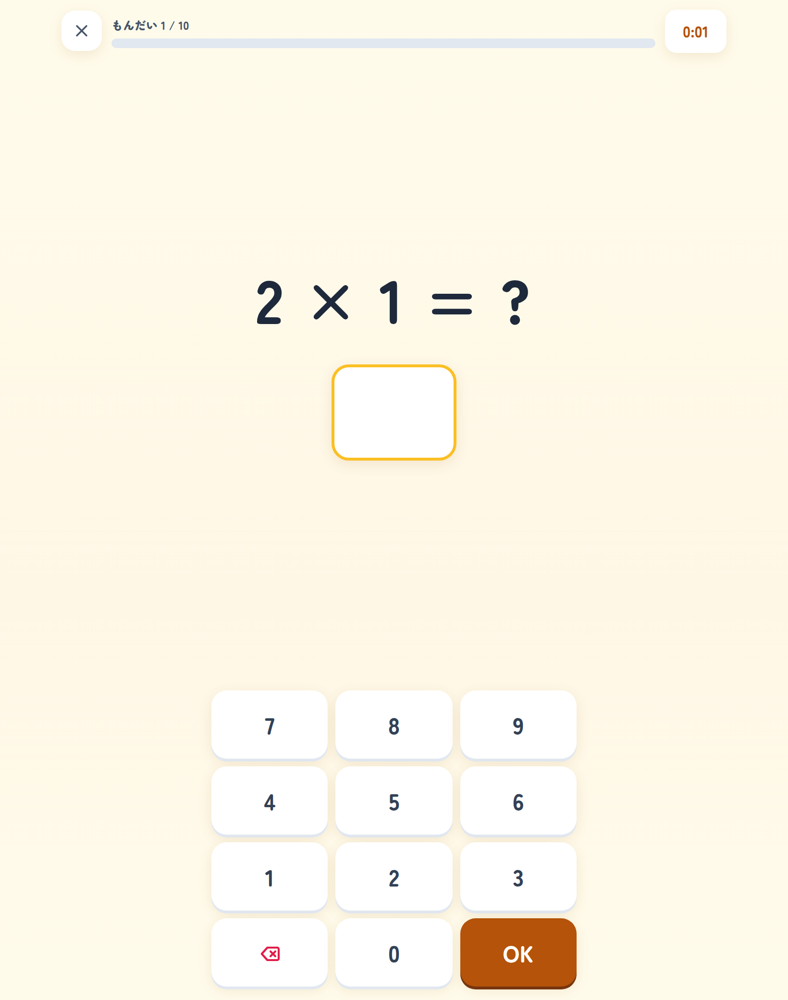

上に「もんだい 1 / 10」と、右に かかって いる 時間が 出ます。

キーボードの ある きかいでは、`0` から `9` の キー、`Backspace`、`Enter` でも おなじ ことが できます。

### まちがえた ときに 出る こたえと「つぎへ」

まちがえると、入れた すうじが 赤く なって、その 下に ただしい こたえと となえかたが 出ます。あわせて こえでも よんで くれます。

この とき、すうじの キーは いったん きえて、かわりに「つぎへ」の ボタンが 出ます。「つぎへ」を おすまで、つぎの もんだいには すすみません。こたえと となえかたを 見て、こえに 出して から すすんで ください。

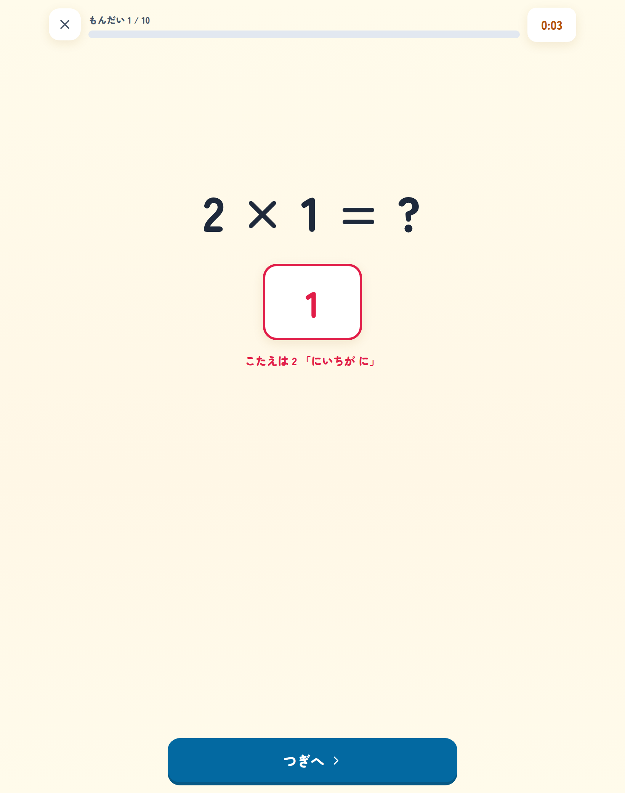

「こたえは 2 「にいちが に」」と 出て います。

【！】おぼえて おいて ほしい こと

- まちがえた もんだいは、けっかの がめんに まとめて 出ます。
- まちがえた 九九は「にがてカード」に あつまります。あとで それだけを れんしゅうできます。
- こえが 出ない きかいでも、文字は かならず 出ます。

### もんだいの かずを えらぶ

せっていの がめんに「もんだいのかず」が 出ます。10もん・20もん・ぜんぶの 3つから えらべます。「ぜんぶ」は、えらんだ だんの カード ぜんぶです。

えらんだ だんの カードより 大きい かずを えらんだ ときは、カードの まいすうの ほうが つかわれます。たとえば 2のだんだけ（9まい）で 20もんを えらぶと、出るのは 9もんです。

この せっていは「こたえてクイズ」と「ふたりでもんだい」の 2つに あります。「カードでれんしゅう」では 出ません。

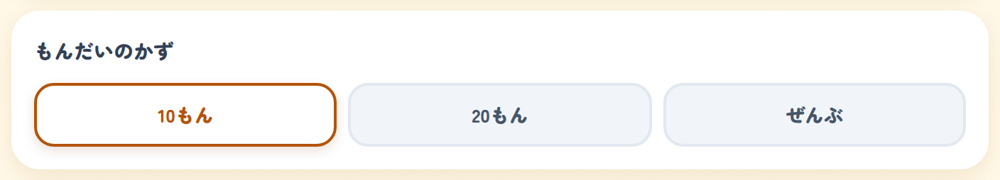

いま えらんで いる ものに 色が つきます。

### タイムと ベストタイムの きまりかた

はじめると、がめんの 右上で 時間を はかりはじめます。おわると、けっかの がめんに「かかったじかん」が 出ます。

ベストタイムは、ぜんぶ せいかいした ときだけ あたらしく なります。1もんでも まちがえると、はやく おわっても ベストタイムは かわりません。まえに ベストタイムが あって、それより はやかった ときは「パーフェクト! しんきろく!」と 出ます。

ベストタイムは「えらんだ だんの くみあわせ」と「もんだいのかず」ごとに べつべつに のこります。2のだんの 10もんと、2のだんと 3のだんの 10もんは、ちがう きろくに なります。

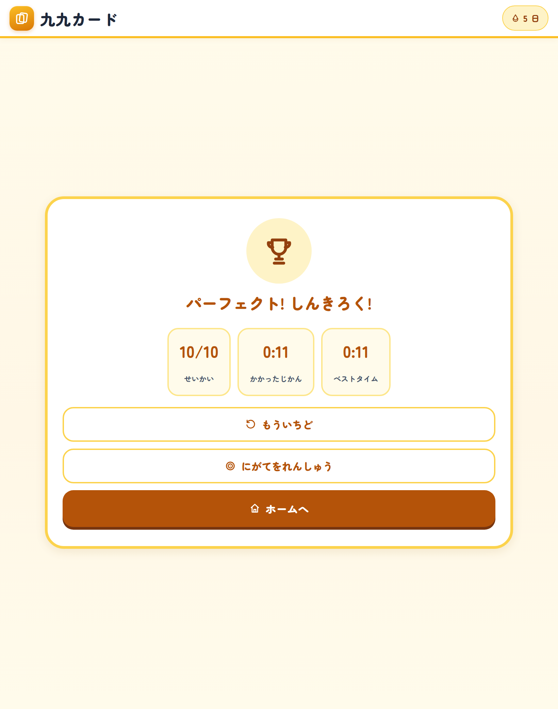

ぜんぶ せいかいしたので ベストタイムが かわりました。

## ふたりで もんだいを 出しあう

ホームがめんの「ふたりでもんだい」から はじめます。1台の タブレットを 2人で つかって、かわりばんこに こたえて、あいてに ○×を つけて もらう れんしゅうです。教室で 計算カードを 出しあうのと おなじ ことが できます。

### あそびかたを たしかめて はじめる

「ふたりでもんだい」を えらぶと、せっていの がめんの 下に「あそびかた」の 青い はこが 出ます。ここに 4つの ながれが 書いて あります。

1. じゅんばんに もんだいに こたえるよ。
2. こたえたら、カードをタップして こたえあわせ。
3. あいてが「せいかい」「ざんねん」をおしてね。
4. おおく せいかいした ほうの かち!

だん・じゅんばん・もんだいのかずは、ほかの れんしゅうと おなじ ように えらべます。えらんだら「はじめる!」を おします。

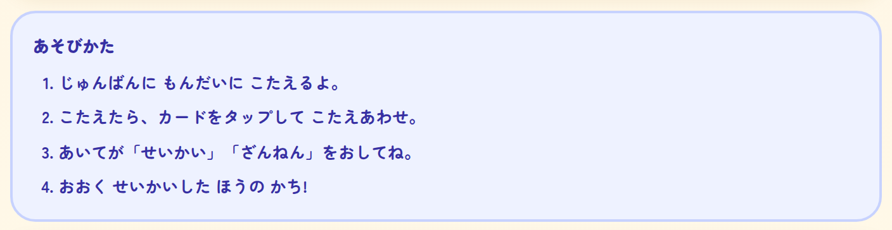

「ふたりでもんだい」を えらんだ ときだけ 出ます。

### こえに 出して こたえ、カードで こたえあわせ

はじまると、がめんの 上に「プレイヤー1の ばん! (のこり10まい)」の ように、いま だれの ばんかと、のこりの まいすうが 出ます。その 上の 左と 右に、2人の てんすうが ならびます。いま こたえる 人の ほうに わくが つきます。

じぶんの ばんの 人は、まん中の カードの しきを 見て、こえに 出して こたえて ください。それから カードを タップします。カードが めくれて、ほんとうの こたえが 出ます。

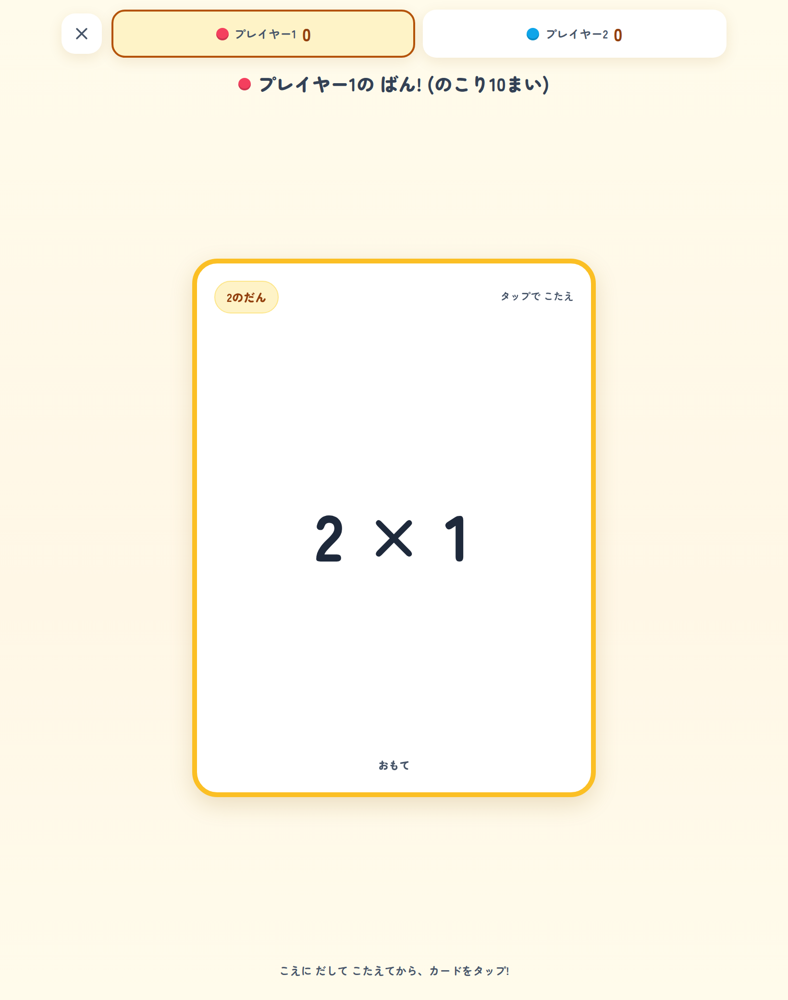

上の おびで、いま だれの ばんかが わかります。

### あいてが「せいかい!」「ざんねん」を おす

カードが めくれると、下に「あっていたかな?」と 出て、みどりの「せいかい!」と 青い「ざんねん」の 2つの ボタンが 出ます。

この 2つを おすのは、こたえた 人では なく あいての 人です。がめんにも「(あいてが おしてね)」と 書いて あります。あって いたら「せいかい!」、ちがって いたら「ざんねん」を おして ください。

おすと てんすうが 入り、つぎの カードに かわって、こたえる 人が 入れかわります。

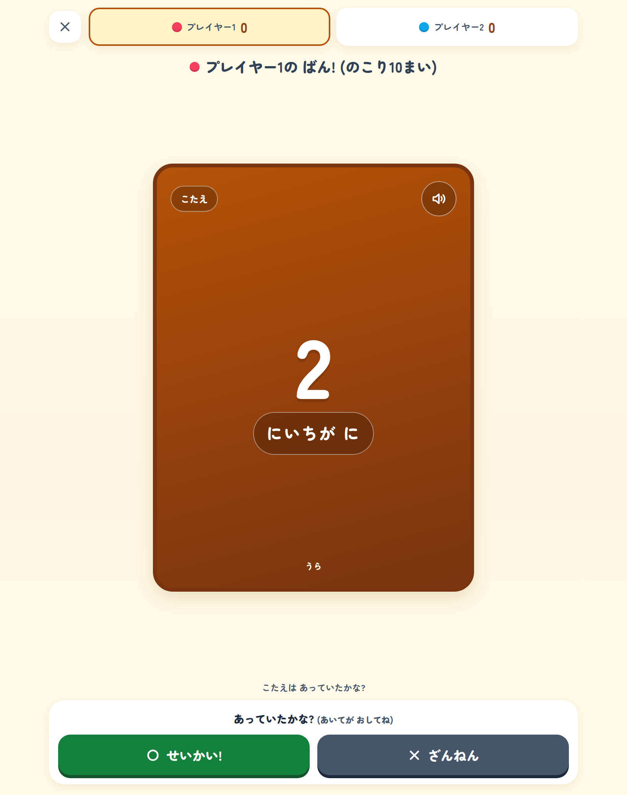

こたえた 人では なく、あいてが おします。

【！】おぼえて おいて ほしい こと

- カードを タップする 前に「せいかい!」を おす ことは できません。かならず めくって から 出ます。
- 「ざんねん」に した 九九は、にがてカードには 入りません。この モードは あいての 見た めで きまるので、きろくには かずだけが のこります。
- とちゅうで やめたい ときは、がめんの 左上の × を おして ください。

### かちまけの きまりかた

ぜんぶの カードが おわると、けっかの がめんに かわります。「プレイヤー1の かち!」の ように 出て、その 下に 2人の てんすうが ならびます。

てんすうが おなじ ときは「ひきわけ! いいしょうぶ!」と 出ます。まけた ほうが わるいわけでは ないので、もう1回 やって みて ください。

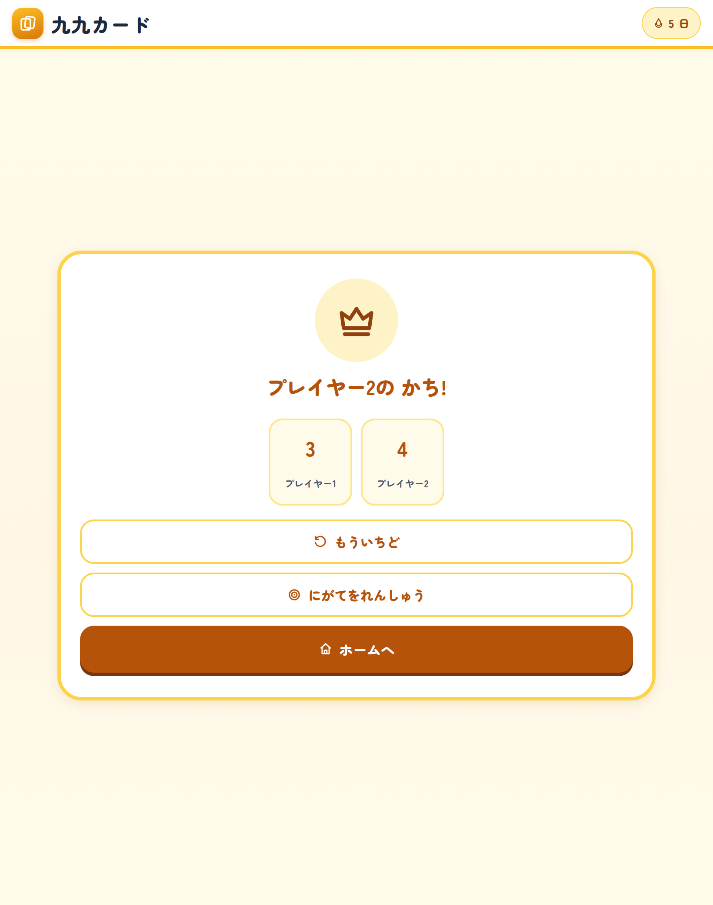

2人の てんすうが ならんで 出ます。

## れんしゅうが おわった あとの けっかの がめん

3つの れんしゅうは、どれも おわると おなじ かたちの けっかの がめんに かわります。上に その 日の できばえ、まん中に すうじ、下に つぎに する ことの ボタンが 3つ ならびます。カードでれんしゅうと ふたりでもんだいでは、おわると かならず 紙ふぶきが とんで ファンファーレが 鳴ります。クイズでは、せいかいが 7わりを こえた ときに 鳴ります。

### けっかの がめんに 出る 3つの すうじ

まん中に ならぶ すうじは、れんしゅうの しゅるいで かわります。

1. カードでれんしゅう … できたカードの まいすう・かかったじかん・「もういちど」に した まいすう
2. こたえてクイズ … せいかいの かず・かかったじかん・ベストタイム
3. ふたりでもんだい … 2人の てんすう

いちばん 上の ことばも かわります。カードでれんしゅうでは、1まいも「もういちど」に しなかった ときだけ「ぜんぶ できた! すごい!」と 出ます。

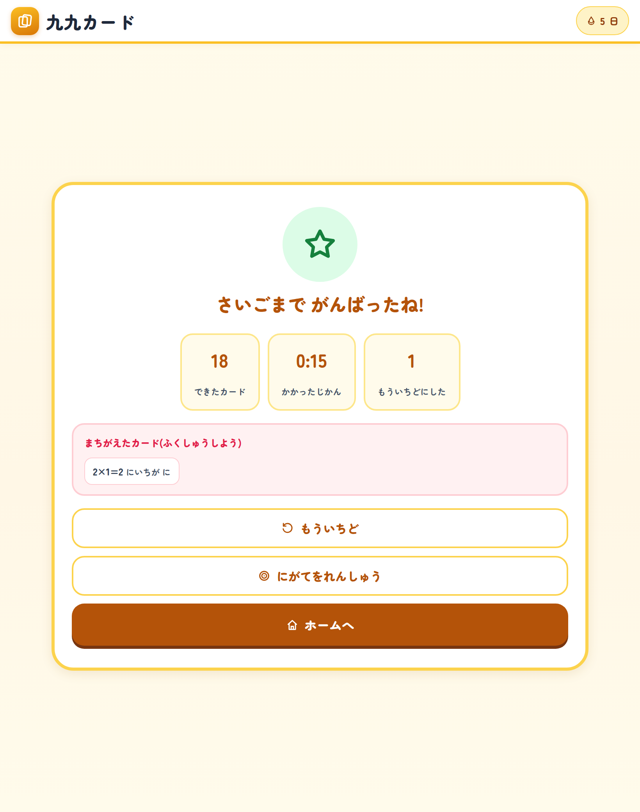

18まい できて、1まいを「もういちど」に しました。

### 「まちがえたカード」で ふくしゅうする

「もういちど」に した カードや、クイズで まちがえた もんだいが あると、すうじの 下に 赤い はこで まとめて 出ます。しきと こたえと となえかたが ならぶので、ここを 見ながら こえに 出して ふくしゅうして ください。

まちがいが 1つも なかった ときは、この はこは 出ません。

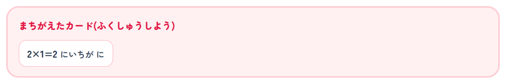

しき・こたえ・となえかたが ならびます。

### つぎに する ことを 3つの ボタンから えらぶ

いちばん 下に ボタンが ならびます。

1. もういちど … いま やった ものと おなじ じょうけんで、もう1回 はじめます。クイズと ふたりでもんだいでは、出る じゅんばんが かわります。
2. にがてをれんしゅう … いま たまって いる にがてカードだけを あつめて れんしゅうします。にがてカードが 0まいの ときは、この ボタンは 出ません。
3. ホームへ … ホームがめんに もどります。

【！】おぼえて おいて ほしい こと

- けっかの がめんから「もどる」の うごきを すると、おわった れんしゅうでは なく、その 1つ前の がめんに もどります。
- 「もういちど」で はじめた ときも、きろくは あたらしく 1回ぶんとして のこります。

## きろく・スタンプで がんばりを ふりかえる

ホームがめんの「きろく・スタンプ」から ひらきます。ここだけは せっていの がめんを とおらず、おした その ばで ひらきます。上から じゅんに、3つの すうじ・スタンプカレンダー・九九マスターマップ・がくしゅうの ふりかえり・メダルが ならびます。

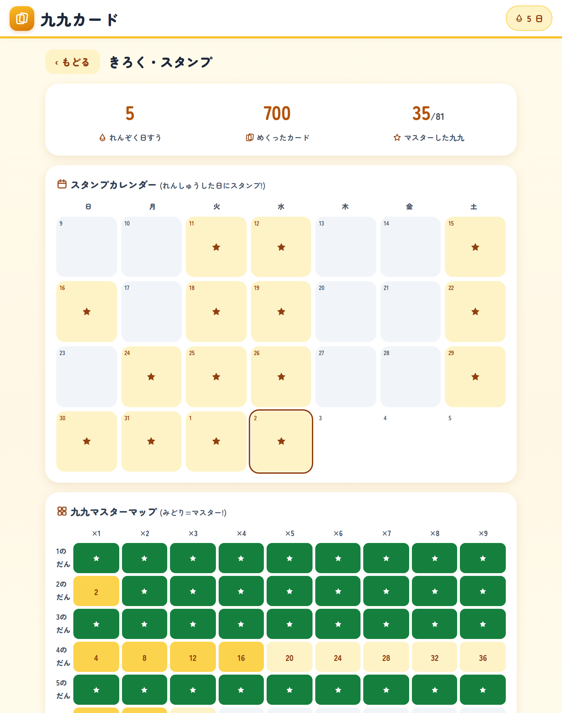

上から じゅんに 5つの まとまりが ならびます。

### いちばん 上の 3つの すうじ

いちばん 上の 白い はこに、3つの すうじが ならびます。

1. れんぞく日すう … きょうか きのうから さかのぼって、なん日 つづけて れんしゅうしたかです。1日 あくと 0に もどります。
2. めくったカード … いままでに めくった カードと こたえた もんだいの ぜんぶの かずです。3つの れんしゅうの ごうけいです。
3. マスターした九九 … 81この 九九の うち、なんこを マスターしたかです。

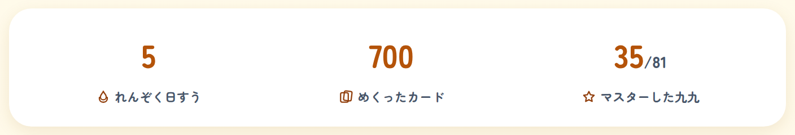

まん中の すうじは、3つの れんしゅうの ごうけいです。

### スタンプカレンダー

れんしゅうした 日に、星の スタンプが つく カレンダーです。日よう日から 土よう日まで よこに ならび、いまの 週を いちばん 下に して、4週間ぶんが 出ます。きょうの ますには こい わくが つきます。

れんしゅうを 1まいでも すると、その 日に スタンプが つきます。まだ 来て いない 日は、うすい ますの ままです。

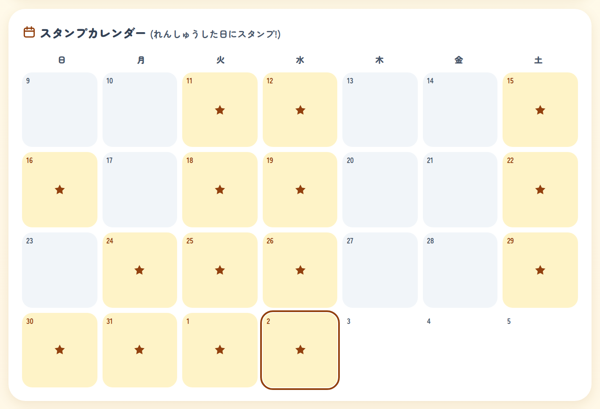

星が ついて いる 日が、れんしゅうした 日です。

### 九九マスターマップ（81の マス）

たてが「○のだん」、よこが「×○」の、81この マスが ならんだ <ruby>表<rt>ひょう</rt></ruby>です。1つの マスが 1つの 九九で、おぼえぐあいで 4つの 色に かわります。

1. まだ … 1回も れんしゅうして いません。
2. れんしゅうちゅう … れんしゅうを はじめた ばかりです。
3. もうすこし … つづけて せいかいして いますが、まだ マスターでは ありません。
4. マスター! … みどりに なって、星が つきます。

3回 つづけて せいかいすると マスターに なります。1回でも まちがえると、その 九九は 0から 数えなおしに なります。まちがえた あとに 3回 せいかいすれば、また みどりに もどります。

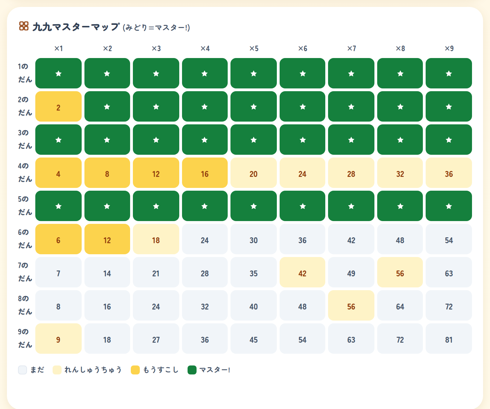

みどりの ますが マスターした 九九です。

がめんが せまい ときは、この <ruby>表<rt>ひょう</rt></ruby>の 中だけを よこに すべらせて 見られます。ページ ぜんたいは うごきません。

マスを おすと、<ruby>表<rt>ひょう</rt></ruby>の 下に しきと こたえと となえかた、それに いままでの せいかいと まちがいの かずが 出ます。おなじ ときに となえかたを こえでも よんで くれます。まだ 1回も れんしゅうして いない マスを おすと「まだ れんしゅうしていないよ」と 出ます。


せいかいと まちがいの かずが 出ます。

### がくしゅうの ふりかえり

この1しゅうかんの ようすを まとめた ところです。れんしゅうを 1回も して いない あいだは、この まとまりそのものが 出ません。

上に 3つの すうじが ならびます。「れんしゅう かいすう」は なん回 れんしゅうしたか、「がくしゅうじかん」は あわせて どれくらい やったか、「1回目で できた」は、1回目で せいかいできた わりあいです。

その 下に、さいきん れんしゅうした きろくが 10回ぶんまで ならびます。日づけ・れんしゅうの しゅるい・えらんだ だん・かかった 時間・せいかいの かずが 1行ずつ 出ます。にがてカードを れんしゅうした ときは「にがて」、とちゅうで やめた ときは「とちゅうまで」の しるしが つきます。

「ふたりでもんだい」だけは、せいかいの かずの かわりに めくった まいすうが 出ます。あいての 見た めで きまる ので、わりあいには 入れて いません。

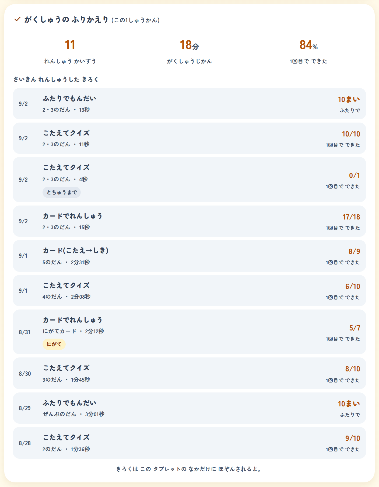

上の 3つが この1しゅうかんの まとめです。

### 12この メダルと、もらえる じょうけん

がんばりに あわせて もらえる メダルが 12こ あります。もらえて いない メダルは 色が うすく なって います。

はじめて れんしゅうした ときの「はじめのいっぽ」、3日・7日・14日・30日 つづけた ときの メダル、カードを 100まい・500まい めくった ときの メダル、クイズに 100もん こたえた ときの メダル、クイズで ぜんぶ せいかいした ときの「パーフェクト」、はじめて 1つ マスターした ときの「はじめてマスター」、1つの だんを ぜんぶ マスターした ときの「だんマスター」、81こ ぜんぶを マスターした ときの「九九マスター」です。

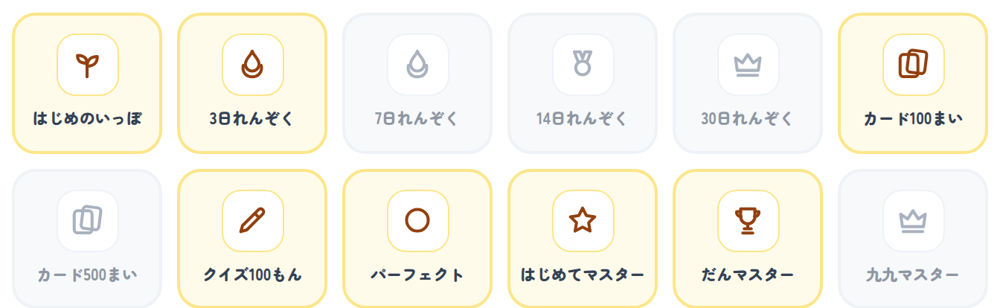

色が うすい ものは、まだ もらえて いません。

## にがてカードだけを あつめて れんしゅうする

まちがえた 九九は、じどうで「にがてカード」に あつまります。あつまった ものだけを あつめて れんしゅうできるので、おぼえにくい ところに 時間を つかえます。

### にがてカードは どうやって きまるのか

1回でも まちがえて、その あと まだ 3回 つづけて せいかいして いない 九九が、にがてカードに なります。

つまり、まちがえた あとに 3回 つづけて せいかいすると、にがてカードから きえます。とちゅうで また まちがえると、数えなおしに なります。九九マスターマップで みどりに なる きまりと おなじです。

「ふたりでもんだい」の「ざんねん」は、にがてカードには 入りません。

### 3つの 入口から にがてカードを はじめる

にがてカードの れんしゅうは、つぎの 3つの どこからでも はじめられます。どこから 入っても、中みは おなじです。

1. ホームがめんの 下に 出る 赤い わくの おしらせを おす。
2. けっかの がめんの「にがてをれんしゅう」を おす。
3. きろく・スタンプの いちばん 下の「にがてカードをれんしゅうする」を おす。

にがてカードの れんしゅうは、カードでれんしゅうと おなじ かたちで はじまります。じゅんばんは いつも バラバラ、カードの むきは いつも「しき → こたえ」です。せっていの がめんは とおりません。

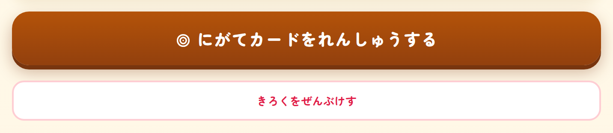

上が にがてカードの ボタンです。

【！】おぼえて おいて ほしい こと

- にがてカードが 0まいの ときは、3つとも ボタンが 出ません。
- にがてカードを れんしゅうしても、えらんで いた だんの せっていは かわりません。
- ここで せいかいすると、九九マスターマップの 色も かわって いきます。

## きろくの ほぞんと、【！！】ぜんぶ けす とき

れんしゅうの きろくが どこに あるのかと、それを ぜんぶ けす ボタンの ことを 書きます。けす ボタンは もとに もどせないので、おす まえに かならず ここを よんで ください。

### きろくは どこに のこるのか

きろくは、いま つかって いる タブレットや パソコンの 中にだけ のこります。インターネットの むこうへ おくる ことは ありません。

名前・しゅっせきばんごう・クラスの 名前を 入れる ところは 1つも ありません。だから、きろくを 見ても だれの ものかは わかりません。

きろくが のこるのは、その きかいの その ブラウザの 中だけです。べつの タブレットで ひらくと、また 0から はじまります。ブラウザの「かんらんりれきの さくじょ」や「サイトデータの さくじょ」を すると、いっしょに きえます。

### 【！！】きろくを ぜんぶ けす

きろく・スタンプの がめんの いちばん 下に「きろくをぜんぶけす」の ボタンが あります。これを おすと、スタンプカレンダー・九九マスターマップ・メダル・にがてカード・ベストタイムが ぜんぶ 0に もどり、えらんで いた せっていも はじめの じょうたいに もどります。

けす ときの てじゅん:

1. きろく・スタンプの がめんを ひらいて、いちばん 下まで すすみます。
2. 赤い 字の「きろくをぜんぶけす」を おします。
3. 「きろくを ぜんぶ けしますか?(もとに もどせません)」と きかれます。
4. ほんとうに けす ときだけ「OK」を おします。やめる ときは「キャンセル」を おします。

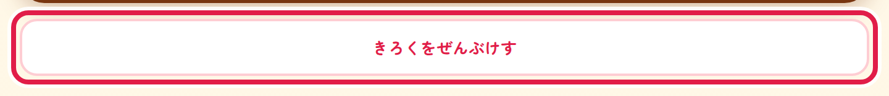

赤い わくの ところが、けす ボタンです。

【！！】いちばん たいせつな ちゅうい

- 1回 けすと、もとに もどす ほうほうは ありません。
- どうしても のこして おきたい ものが ある ときは、けす まえに がめんを さつえいするか、紙に <ruby>印刷<rt>いんさつ</rt></ruby>して ください。
- この ボタンで きえないのは「がくしゅうの ふりかえり」だけです。そこは ほかの <ruby>学習<rt>がくしゅう</rt></ruby>アプリと おなじ 場しょを つかって いるので、のこして あります。ぜんぶ けす ときは、ブラウザの「サイトデータの さくじょ」を つかって ください。
- ほかの <ruby>学習<rt>がくしゅう</rt></ruby>アプリの きろくは、この ボタンでは きえません。

### 1台を 何人かで つかう ときの ちゅうい（先生むけ）

このアプリは、だれが つかって いるかを 見わけません。おなじ タブレットを 何人かの <ruby>児童<rt>じどう</rt></ruby>で つかうと、スタンプも マスターマップも メダルも まざります。

きろくを つかう ときは「1台に つき 1人」に して ください。まざっても かまわない ときや、きろくを つかわずに れんしゅうだけを する ときは、そのままで だいじょうぶです。

## きろくの がめんを 紙に <ruby>印刷<rt>いんさつ</rt></ruby>する（先生むけ）

きろく・スタンプの がめんは、そのまま 紙に 出せます。<ruby>学期<rt>がっき</rt></ruby>の おわりの ふりかえりや、おうちの 人に 見せる ときに つかえます。ここは 先生が よむ ところです。

### <ruby>印刷<rt>いんさつ</rt></ruby>の しかた

じゅんばんに すすめて ください。

1. きろく・スタンプの がめんを ひらきます。
2. キーボードの `Ctrl` と `P` を いっしょに おします（Mac は `⌘` と `P`）。
3. <ruby>印刷<rt>いんさつ</rt></ruby>の プレビューが 出るので、A4 の たてに なって いる ことを たしかめます。
4. 色が 出て いない ときは、<ruby>印刷<rt>いんさつ</rt></ruby>の せっていの「はいけいの グラフィック」を オンに します。
5. 「<ruby>印刷<rt>いんさつ</rt></ruby>」を おします。

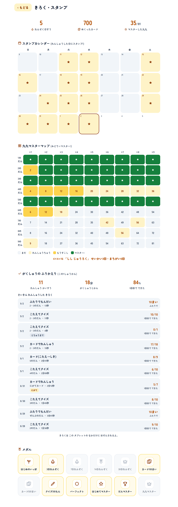

上の おびと 下の 2つの ボタンは 出ません。

【！】おぼえて おいて ほしい こと

- 用紙の 大きさと むきは、はじめから A4 の たてに なる ように して あります。
- <ruby>児童<rt>じどう</rt></ruby>の 名前は どこにも 出ません。だれの 紙かが わかるように、手で 名前を 書きこんで ください。
- 九九マスターマップは、がめんが せまい ときは よこに すべらせて 見る かたちですが、紙には 81ます ぜんぶが 出ます。

### 紙に 出る ものと 出ない もの

紙に 出るのは、いちばん 上の 3つの すうじ・スタンプカレンダー・九九マスターマップ・がくしゅうの ふりかえり・メダルです。見出しの 左に ある「もどる」の ボタンだけは、紙にも のこります。

出ないのは、いちばん 上の おび（アプリの 名前と れんぞく日すう）、あたらしい ばんの おしらせ、「にがてカードをれんしゅうする」、「きろくをぜんぶけす」の 4つです。まちがえて 紙に 出ないように して あります。

### <ruby>電子黒板<rt>でんしこくばん</rt></ruby>や 大きな がめんに うつす

<ruby>一斉<rt>いっせい</rt></ruby>じゅぎょうで つかう ときは、ブラウザを ぜんがめん（`F11`）に すると 見やすく なります。

うしろの せきから 見えない ときは、ブラウザの ズームで 大きく して ください。パソコンは `Ctrl` と `+`、iPad は 2本の ゆびで 広げます。この アプリは ズームを とめて いないので、どこまででも 大きく できます。

## うまく いかない とき

よく ある ことを 5つ あげます。上から じゅんに たしかめて みて ください。

### 音や よみあげが 出ない とき

こうかおん（めくる 音や せいかいの 音）が 出ない ときは、「カードでれんしゅう」の がめんの 右上の スピーカーの ボタンを たしかめて ください。ここが オフに なって いると、クイズや ふたりでもんだいの 音も 出ません。きかいが マナーモードに なって いないかも 見て ください。

となえかたの よみあげが 出ない ときは、その きかいや ブラウザが よみあげに たいおうして いない ことが あります。その ときでも、こたえと となえかたの 文字は かならず 出ます。よみあげは 上の スピーカーの ボタンでは きえません。

### きろくが きえた とき

ブラウザの「かんらんりれきの さくじょ」や「サイトデータの さくじょ」を すると、きろくも いっしょに きえます。もとに もどす ほうほうは ありません。

iPad の Safari は、7日いじょう 1回も ひらかないと きろくを きして しまう ことが あります。ホームがめんに 入れて おくと、これが おきにくく なります。

ちがう タブレットで ひらいた ときも、きろくは 0から です。きろくは きかいの 中に あるので、ほかの きかいには うつりません。

### がめんが 古いまま かわらない とき

あたらしい ばんが 出ると、がめんの いちばん 上に こげ茶色の おびで「あたらしい ばんが あります」と 出ます。

「さいしんに する」を おすまで、がめんは 入れかわりません。れんしゅうの とちゅうで 中みが きえて しまわない ように して あるので、おわってから おして ください。

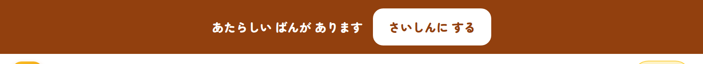

右の ボタンを おすと あたらしく なります。

おしらせが 出ないのに 古いまま だと 思う ときは、ページを もういちど よみこんで ください。

### 字の かたちが いつもと ちがう とき

この アプリの 字（書体）は、アプリと おなじ ところから いっしょに とどきます。とどく まえに 出た ときや、その きかいが この 書体を つかえない ときは、きかいに もとから 入って いる 字で 出ます。

うごきには ぜんぜん もんだいが ないので、そのまま つかって だいじょうぶです。もう1回 ひらくと、たいてい いつもの 字に もどります。

### それでも なおらない とき

つぎの 3つを じゅんに ためして ください。

1. アプリを とじて、もう1回 ひらきます。
2. きかいを さいきどうします。
3. ちがう ブラウザ（Chrome など）で ひらいて みます。

それでも なおらない ときは、まず この アプリを おしえて くれた 先生や、学校の じょうほうの たんとうの 先生に そうだんして ください。それでも わからない ときは、この ページの いちばん 下に ある <ruby>問<rt>と</rt></ruby>いあわせ先を つかって ください。
