# 教室で使えるかもしれないもの作り #◯ 「九九カード、どこにいったの?」なくさない、丸付けもいらない計算カードアプリ「九九カード」

## 🏫 はじめに

二学期、二年生の算数はかけ算九九に入ります。宿題に計算カードを出して、次の日に「なくしました」と言われたことはありませんか。輪ゴムが切れて机の中でばらばらになっていたり、家の人にめくってもらう約束が、いつのまにか子ども一人で黙って眺めるだけになっていたり。

九九の練習は、くりかえした回数がそのまま力になります。それが分かっているからこそ、カードが行方不明になるたびに、練習そのものが止まってしまうのがもったいないと感じていました。かといって、紙のカードをやめてプリントに切りかえると、今度は「めくって、答えて、しわける」というあの動きが消えてしまいます。あの動きこそが計算カードの中身なのに、です。

九九のアプリは世の中にたくさんあります。ただ、そのほとんどは四つの選択肢から正しいこたえを選ぶ形です。あれは手軽でよくできているのですが、答えを思いだしているのか、四つの中から消去法で選んでいるのかが、外から見分けられません。計算カードが長く使われてきたのは、こたえを見る前に自分の口から言わせるからだと思っています。そこを飛ばしたくありませんでした。

そこで、紙のカードの動きをそのまま残したまま、なくならないようにしたものを作りました。今回紹介するのは、タブレットや Chromebook で使える計算カードアプリ「九九カード」です。

https://kake-master.giga-school.com/

インストールも登録もいりません。上のアドレスを開けば、その場ですぐ始められます。名前も出席番号も入力しません。

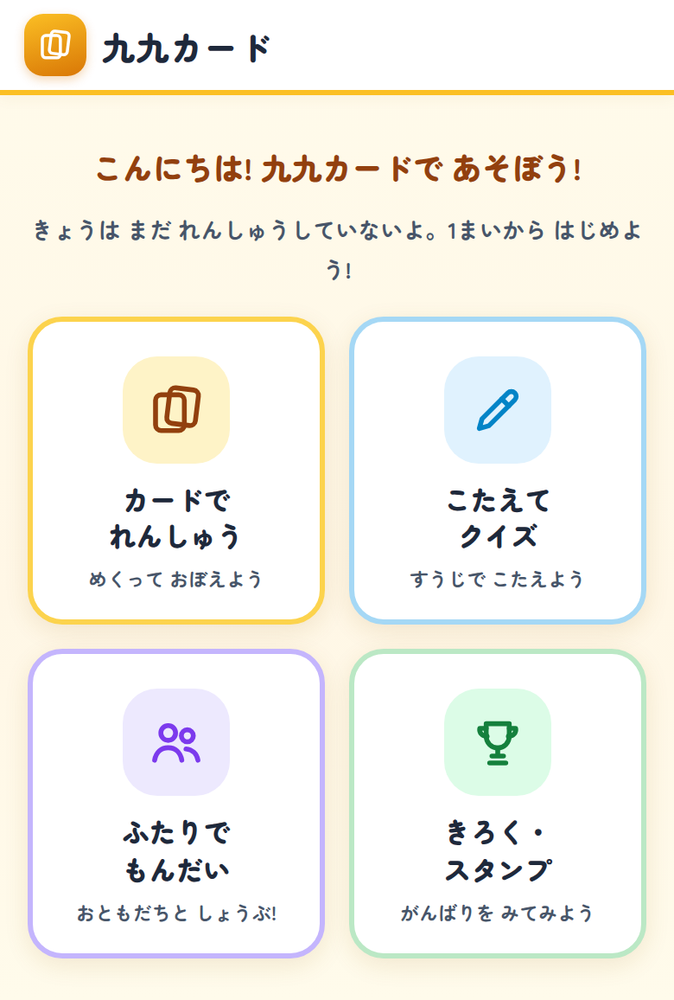

ひらいたところ。まずは四つのボタンだけです。

## 📱 このアプリでできること

できることは四つです。カードをめくって練習する、数字を打って確かめる、となりの子と出し合う、そしてがんばりを見かえす。この四つが、そのままホーム画面の四つのボタンになっています。

画面の文字はすべてひらがなにしました。九九を習うのは二年生です。その子たちが自分で読んで、自分で選んで、自分で始められるところまでを目安にしています。先生が一人ずつ設定してまわるアプリは、忙しい教室では結局使われなくなる、というのが正直な実感でした。

ボタンを四つにしぼったのも同じ理由です。機能を足そうと思えばいくらでも足せるのですが、最初の画面に八つ並んでいたら、二年生は選ぶところで止まります。始めるボタンには、いま何枚のカードで練習することになるのかを書いてあります。押す前に見通しが立つようにするためです。

### カードでれんしゅう

紙の計算カードと同じ使いかたをするモードです。練習する段を選んで、始めます。段はいくつでも選べるので、二の段だけ、二の段と五の段だけ、といった使いかたができます。

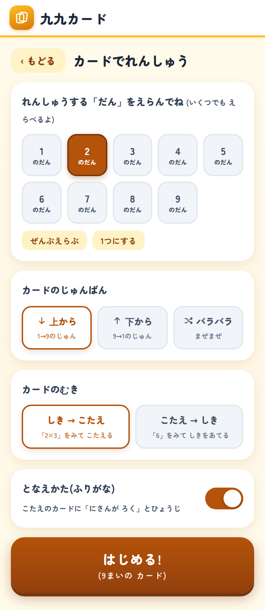

れんしゅうを始める前の画面。段、じゅんばん、カードのむき、ふりがなをここで決めます。

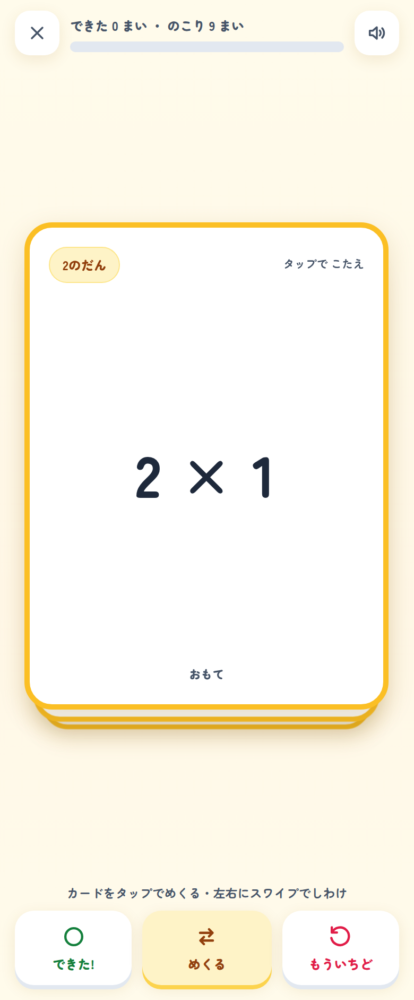

しきが出ているところ。声に出して答えてから、カードをタップします。

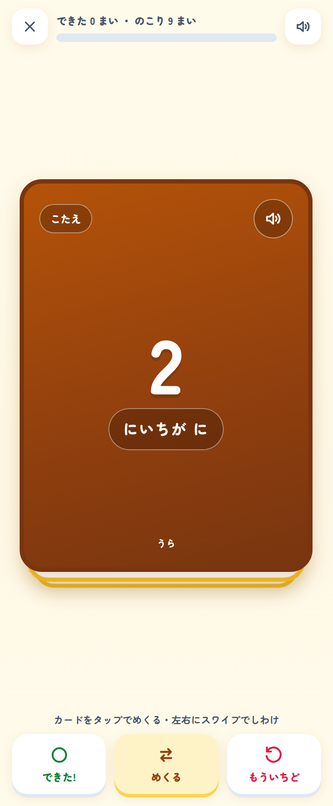

めくったところ。こたえと、となえかたが出ます。スピーカーのボタンを押すと読み上げます。

じゅんばんは、上から、下から、バラバラの三つから選べます。上からのじゅんばんだと、子どもは答えを覚えているのではなく並びを覚えていることがあります。バラバラにすると、そこがすぐ分かります。

### こたえてクイズ

数字のキーで答えを打ちこむモードです。十問、二十問、ぜんぶの三つから選べます。時間も計るので、同じ十問をくりかえして自分の記録を縮めていく、という遊びかたもできます。

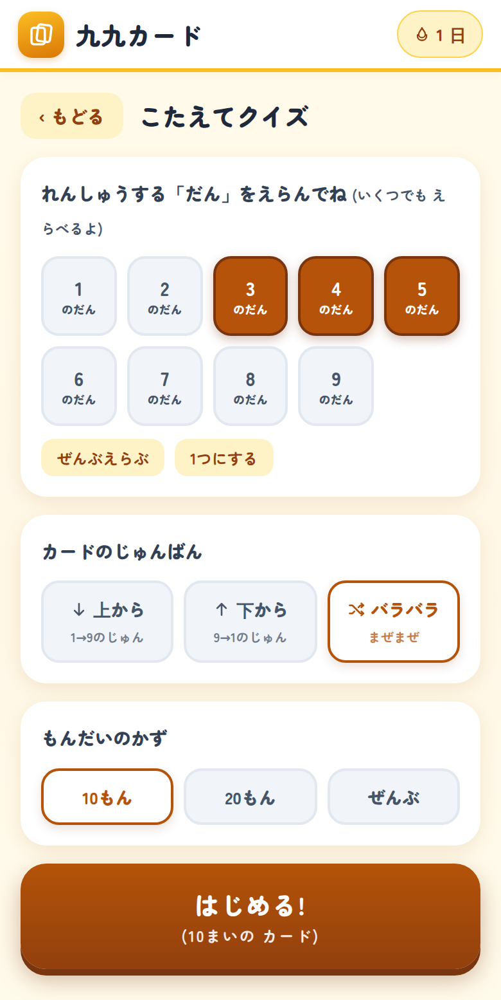

もんだいのかずを選べます。すきま時間なら十問、まとめの時間なら二十問、といった使いわけができます。

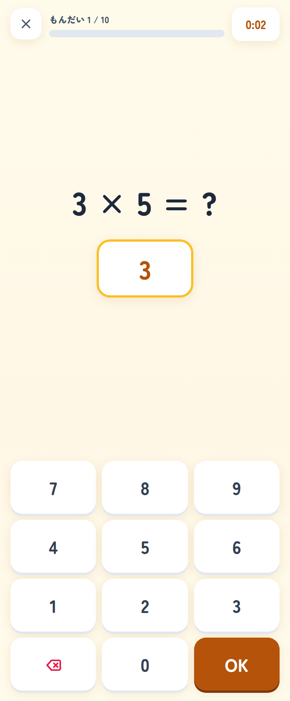

数字のキーは大きめにしました。指の太い子や、手先の動きがまだぎこちない子でも押しまちがえにくい大きさにしてあります。

まちがえたときは、正しい答えと、となえかたを出します。ここは意識して作ったところです。まちがえた瞬間に正しい言いかたを一度通しておかないと、あやしい覚えかたのまま次に進んでしまうからです。読み上げも同時に流れます。

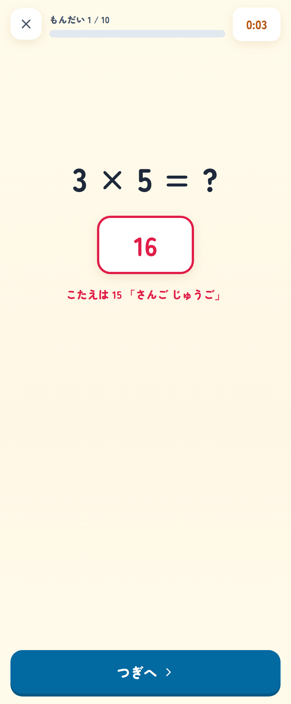

まちがえたときだけ、正しいこたえととなえかたが出ます。ここだけは自動で次に進みません。

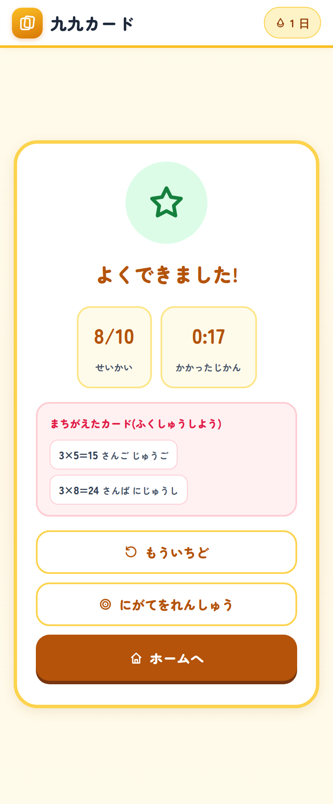

おわると、まちがえたカードが一覧で出ます。ここを見ながら、その場でもう一度練習できます。

### ふたりでもんだい

教室で実際にやっているペア学習を、そのまま画面に持ってきたモードです。交代で問題に答え、相手が正解かどうかを押します。

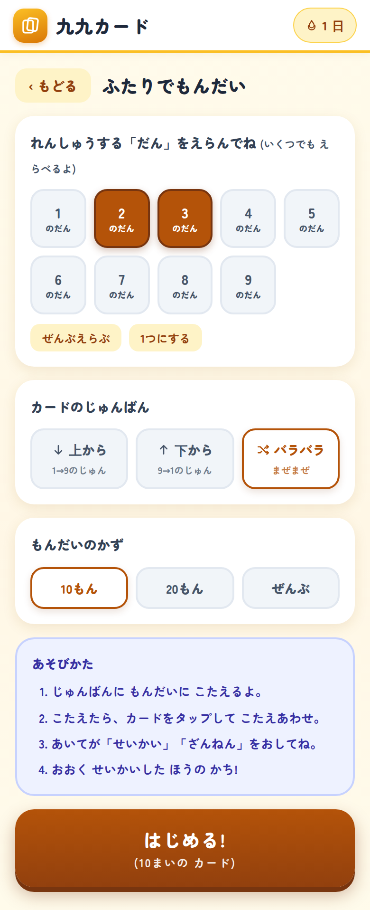

始める前に、あそびかたが出ます。読んでから始められるようにしました。

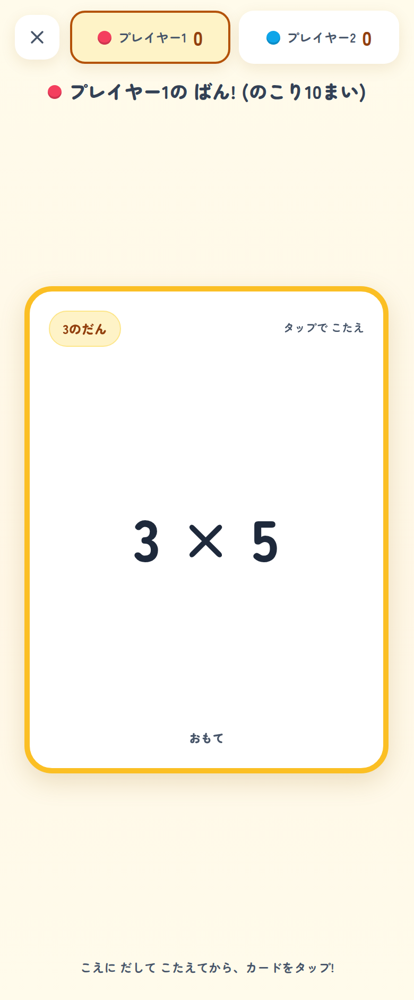

いまどちらの番かが、いちばん上に出ます。

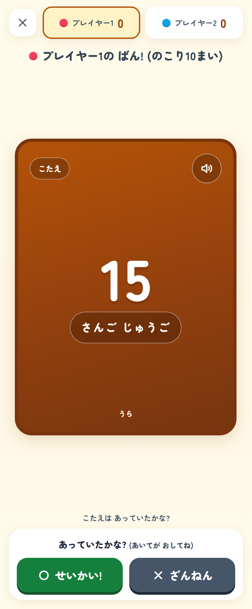

カードをめくったあと、相手が正解かどうかを押します。判定を機械にやらせなかったのは、声に出して答えるところを残したかったからです。

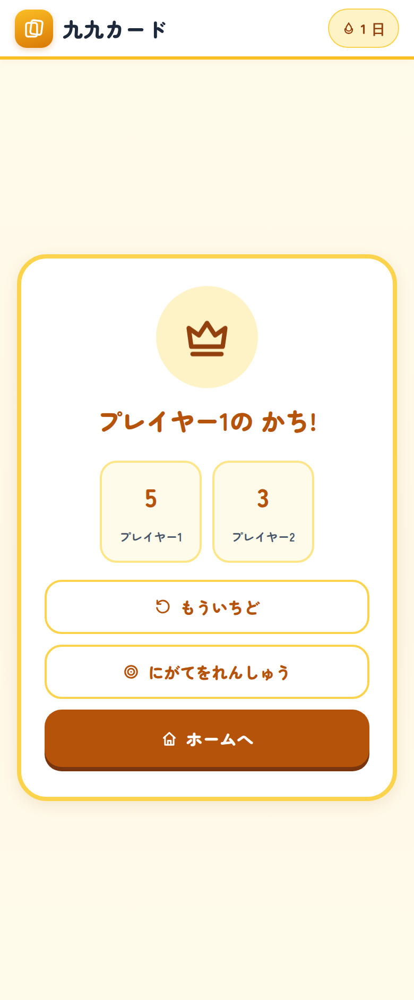

最後に得点と勝敗が出ます。

## 🎴 紙のカードのまま、めくって しわける

このアプリでいちばん時間をかけたのは、カードをめくる感じと、しわける感じです。

紙の計算カードでやっていることを思いだしてみると、子どもは答えを言ったあとに、できたカードとあやしいカードを二つの山に分けています。この分ける動きが、実は練習の中心にあります。自分で「これはまだ」と決めるから、次にもう一度出てくる。あの手ごたえを消したくありませんでした。

そこで、カードを左にはらうと「できた」の山へ、右にはらうと「もういちど」の山へ入るようにしました。もういちどにしたカードは山の下にもどって、あとでまた出てきます。ぜんぶが「できた」になるまで終わりません。紙のカードと同じです。

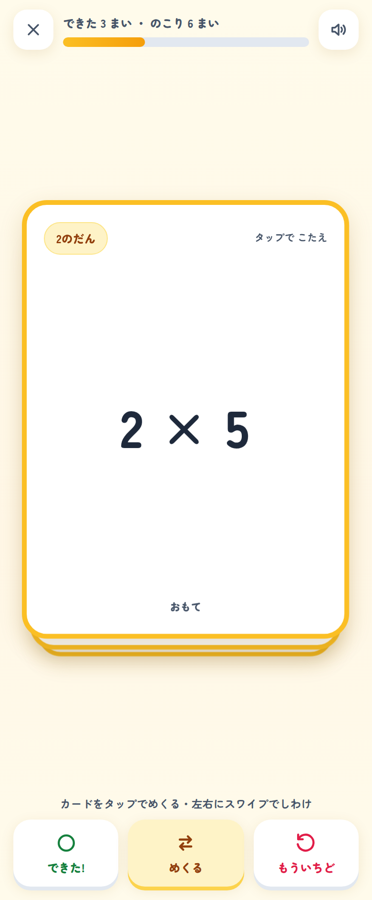

上の帯に、できた枚数とのこりの枚数が出ます。あと何枚かが分かると、もうひとふんばりがききます。

見た目のところも、けっこうしつこく調整しました。カードは三枚ぶんが少しずつずれて重なって見えるようにして、束の厚みが残るようにしています。タップするとカードが立体的に回ってうらが出ます。ただの画面の切りかえにすると、めくった感じが消えてしまうからです。細かいところですが、ここが気持ちよくないと、子どもは二回目をやりません。

音は出したり消したりできます。教室で三十人が一斉に使うと効果音がうるさいので、練習画面の右上のスピーカーのしるしですぐ切れるようにしました。学校で消して、家では出す、という使いわけができます。

スワイプが苦手な子のために、画面の下に同じはたらきのボタンも並べました。キーボードのある端末なら、左右のキーとスペースキーだけで最後まで進められます。指先の動きに自信がない子が、操作でつまずいて算数から離れてしまうことのないようにしたかったからです。

もうひとつ、カードのむきを入れかえられるようにしました。ふつうはしきを見てこたえを言いますが、逆にして、こたえを見てしきをあてることもできます。

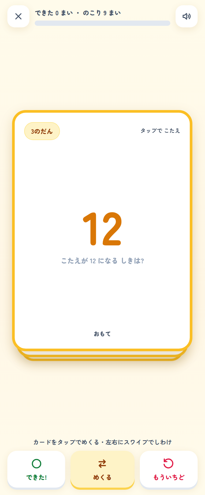

12 を見て、こたえが 12 になるしきをさがします。この向きは、わり算に入るときに効いてくると思っています。

九九には、教科書に載っているとなえかたがあります。「ににんが し」「しちしち しじゅうく」のような、あの言いかたです。81通りぶんをすべて入れて、こたえのカードに出るようにしました。文字だけでなく音でも出るので、家で一人で練習していても、言いかたがずれたまま固まってしまうことが減ると思います。

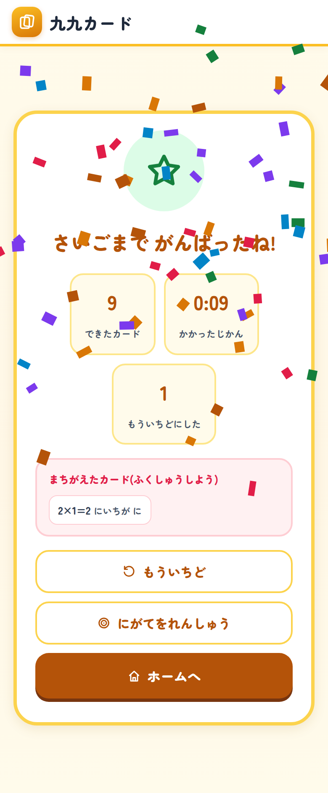

ひとまわり終わると、紙ふぶきが出ます。ここは子どもの喜ぶ顔を想像して入れました。

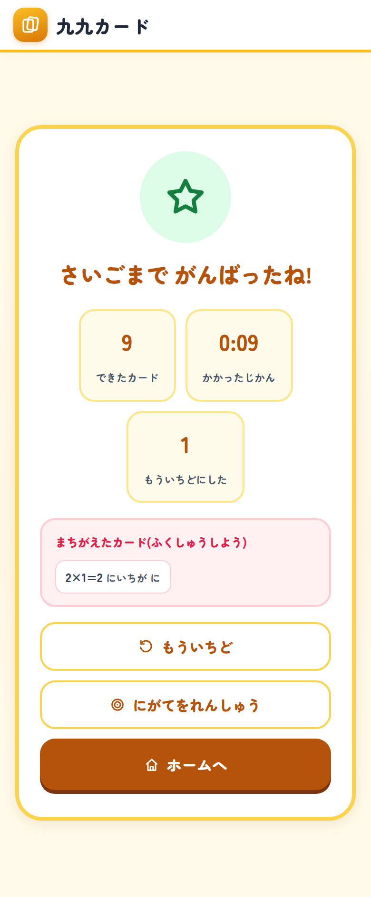

紙ふぶきがおさまると、できた枚数と、もういちどにした枚数が残ります。

## 🗺️ どの九九が身についたかが、81マスで見える

九九は全部で81通りあります。ところが、どの子がどの九九でつまずいているかは、テストの点数だけではなかなか見えてきません。七の段が全体的にあやしいのか、それとも「しちは ごじゅうろく」のところだけ毎回止まるのか。この差は、指導のしかたがまったく変わるところです。

そこで、81通りをそのまま81マスにして、色で見えるようにしました。

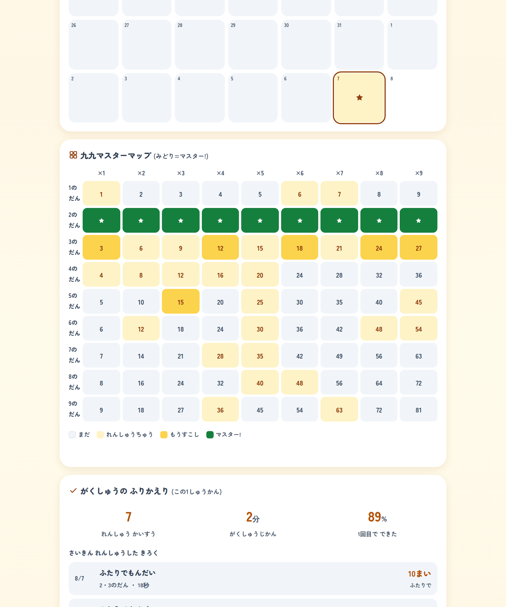

みどりがマスターです。うすい色は、練習はしたけれどまだ安定していないところ。まっさらな水色は、まだ手をつけていないところです。

みどりになる条件は、そのカードを続けて三回できたときにしました。一回できただけでみどりにすると、まぐれ当たりがマスターになってしまいます。三回続けてできて、はじめて「身についた」と呼ぶことにしています。逆に、一度まちがえるとみどりから外れます。きびしいようですが、九九は使う場面で止まらないことが大事なので、そこは甘くしませんでした。

にがてなカードの決めかたも、同じ考えかたにしました。一度でもまちがえて、そのあとまだ三回続けてできていないカードが、にがてに入ります。まちがえた回数だけで決めると、たまたま押しまちがえた一回がいつまでも残ります。できるようになったら静かに外れていく、という形にしたかったので、その後の様子を見て決めるようにしました。

まちがえたカードは自動で集まります。ホームにもどると、まとめて練習できる案内が出ます。

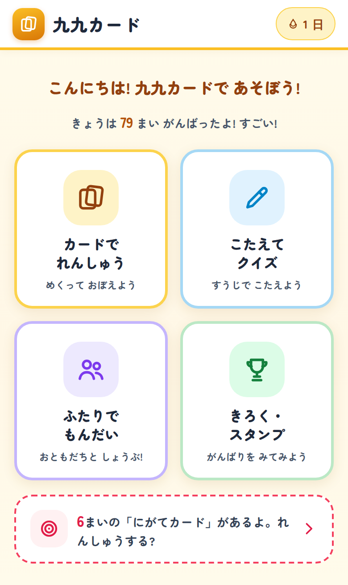

にがてカードがたまると、ホームの下に出ます。子どもが自分で気づいて、自分で押せる場所に置きました。

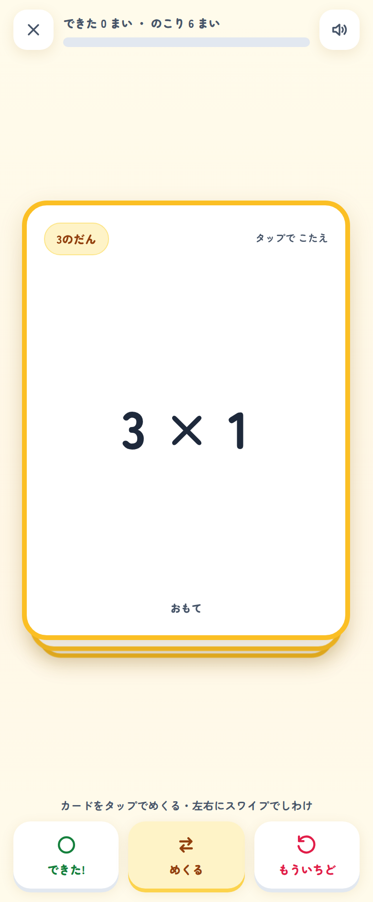

押すと、あやしいカードだけを集めた山になります。全部の段をもう一度まわす必要はありません。

練習した日には、カレンダーにスタンプがつきます。

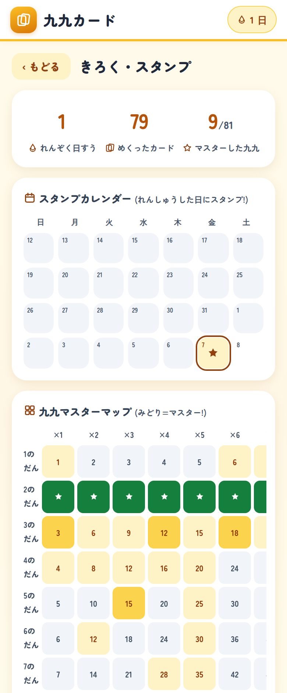

一日一つ、その日にれんしゅうしたらスタンプ。連続した日数も出ます。

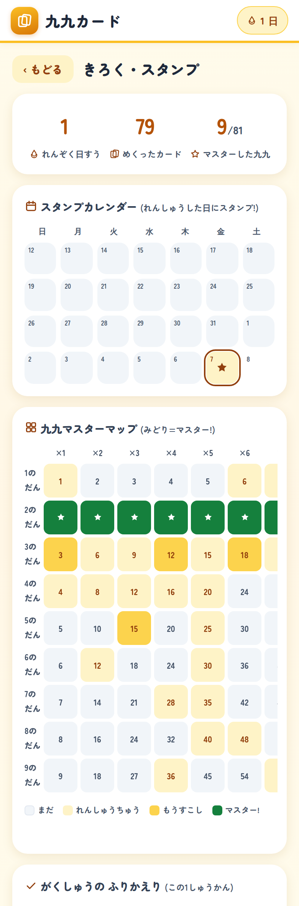

連続日数、めくったカードの数、マスターした九九の数が、いちばん上にまとまっています。

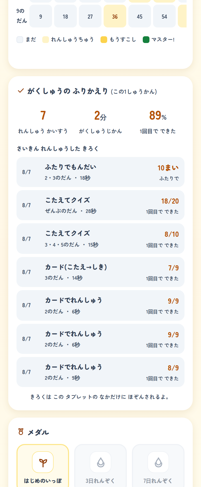

この一週間の回数と時間、そして一回目でできた割合が出ます。最近の記録も十件まで並びます。

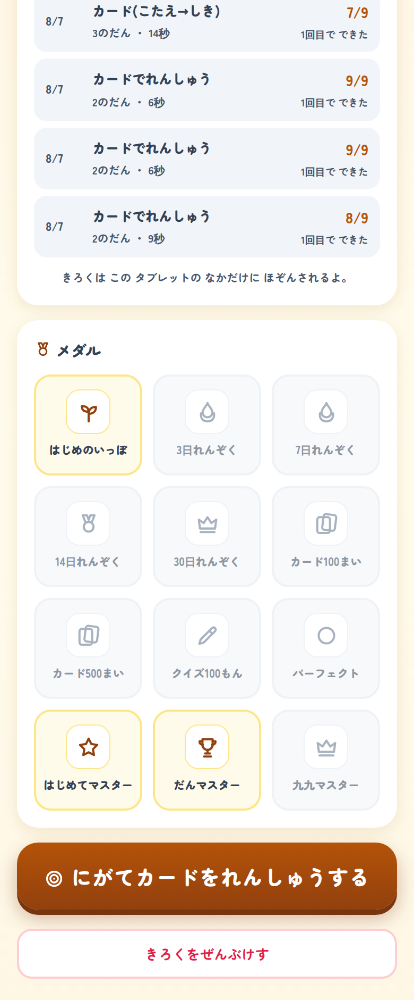

メダルは12種類あります。続けた日数、めくった枚数、全問正解、九九マスターなど、ねらいどころを分けてあります。

この記録の画面は、そのまま印刷できます。ボタンや帯は印刷されず、カレンダーとマスターマップとメダルだけが出るようにしてあるので、学期のまとめや個人面談の資料にそのまま使えます。

## ✨ 導入のメリット

三つのいいことが期待できます。

一つ目は、丸付けに追われなくなることです。これまで家の人か先生がやっていた答え合わせを、アプリが引きうけます。しかも、まちがえた九九は自動で集まって、次の練習の山になります。先生がやっていた「この子は七の段があやしいな」という見取りの一部を、機械が肩がわりしてくれる形です。

二つ目は、カードがなくならないことです。紙の束を持ち帰らせる必要がないので、忘れた、なくした、家に置いてきた、が起きません。同じ理由で、家庭に「計算カードを買ってください」とお願いする場面も減らせます。

三つ目は、どの子がどこで止まっているかが、色で分かることです。81マスのマップを見れば、その子のつまずきが一目で見つかります。声をかけるべき子と、かける言葉が、はっきりします。ここに時間を使えるようになるのが、いちばん大きいと思っています。

## 🛠️ 【管理者向け】導入手順

情報担当の先生に聞かれそうなところを、先にまとめておきます。

まず、個人情報についてです。このアプリは、名前も出席番号もメールアドレスも入力させません。持っていないので、送りようがありません。学習の記録は、その端末のなかにだけ残ります。外のどこかに送ることは一切していません。誰の記録かは、端末が変われば分からなくなります。

つぎに、校内のフィルタリングです。許可が必要なアドレスは次の三つです。

1. kake-master.giga-school.com（アプリ本体です。ここだけは通してください）
2. fonts.googleapis.com（字の形のためだけに使っています）
3. fonts.gstatic.com（同じく字の形のためです）

下の二つが止まっていても、アプリは問題なく動きます。字の形が端末の標準のものに変わるだけです。「いつもと字がちがう」と子どもが言ってきたら、それが理由です。動作に影響はありません。

外から実行するプログラムを取ってくることは一切していません。最初に読みこむ大きさもあわせて 140 キロバイトほどです。三十人が一斉に開いても、校内の回線を圧迫しにくい作りにしてあります。

一度開いたあとは、通信が切れていても使えます。体育館や特別教室など、電波が届きにくい場所でも止まりません。

アプリとして端末に入れておくこともできます。

1. Chromebook と Windows の Chrome では、画面の右上に出る「インストール」を押します
2. 出てこないときは、アドレスバーの右のほうにある小さなしるしから入れられます
3. iPad の Safari には「インストール」が出ません。共有ボタンから「ホーム画面に追加」を選びます

iPad を使っている学校には、ひとつだけお伝えしておきたいことがあります。iPad の Safari は、七日間まったく使わないでいると、保存した記録を消してしまうことがあります。ホーム画面に追加しておくと、これが起きにくくなります。学期のまとめとして残しておきたい記録があるときは、早めに画面を撮っておいてください。

共用の端末で使う場合は、注意が必要です。同じ端末を複数の子どもが使うと、記録が混ざります。記録まで使いたいなら一人一台にしてください。それが難しいときは、記録は見ないことにして、練習の道具としてだけ使うのが安全です。

新しい版が出たときは、画面の上に「あたらしい ばんが あります」と出ます。押すまで切りかわりません。練習のとちゅうで画面が入れかわって、それまでの入力が消えるのを避けるためです。授業のあいだは押さずに、終わってから押してもらえば大丈夫です。

拡大はふさいでいません。指二本でひろげる操作も、キーボードの拡大も、そのまま効きます。誤って拡大されるわずらわしさより、見えづらい子が大きくできないほうが困ると考えたからです。後ろの席から見えないときは、遠慮なく拡大してください。電子黒板に映すときは、ブラウザを全画面にすると見やすくなります。

うまくいかないときに、よくある三つのことを書いておきます。

一つ目は、字の形がいつもとちがう場合です。これは校内の設定で字のデータが止まっているだけで、故障ではありません。そのまま使って大丈夫です。

二つ目は、画面が真っ白になった場合です。まず一度、ページを読みこみなおしてください。それでも直らないときは、Chrome で開いてみてください。

三つ目は、記録が消えた場合です。ブラウザの閲覧データを消すと、このアプリの記録も一緒に消えます。端末を配りなおすときや、まとめて設定を初期化するときは、その前に記録の画面を印刷しておくと安心です。

なお、記録を消すボタンはアプリの中にもあります。消えるのはこのアプリのぶんだけで、ほかの学習アプリの記録までは消えません。学年が上がって端末を引きつぐときは、ここから消してください。

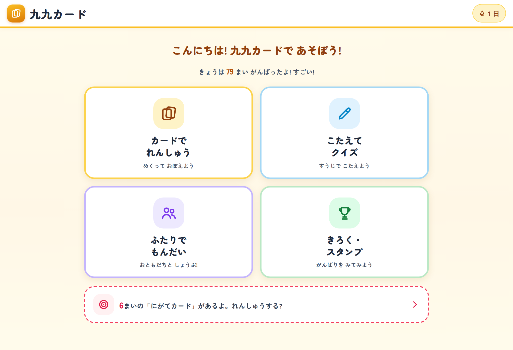

Chromebook の横長の画面でも、そのまま使えます。

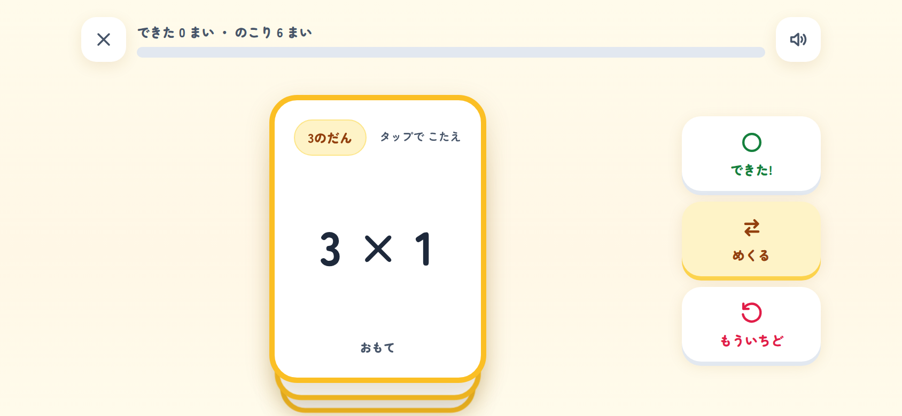

タブレットを横にすると、カードと操作ボタンが左右に並びます。机の上に寝かせて置いたときに押しやすい配置です。

## 📖 【利用者向け】使い方のガイド

子どもたちに説明するときの手順です。二年生に伝える言葉で書いてあります。

1. 配られたアドレスを開きます
2. 四つのボタンから、やりたいものを選びます。はじめてなら「カードでれんしゅう」です
3. れんしゅうする「だん」を押します。いくつ選んでもかまいません
4. 「じゅんばん」を選びます。覚えたてなら上から、たしかめるならバラバラです
5. 「カードのむき」を選びます。ふつうは、しきを見てこたえます
6. 「はじめる!」を押します
7. しきが出たら、声に出してこたえます
8. カードをタップして、こたえをたしかめます
9. できたら左へ、あやしかったら右へ、カードをはらいます。下のボタンでも同じです
10. のこりが0まいになったら、おしまいです

クイズをやるときは、二番目のボタンを選びます。数字のキーで答えを打って、最後に OK を押します。まちがえたときだけ、正しいこたえととなえかたが出ます。読んでから「つぎへ」を押してください。

となりの子とやるときは、三番目のボタンです。順番に答えて、相手に正解かどうかを押してもらいます。

自分のがんばりを見たいときは、四番目のボタンです。カレンダーのスタンプ、81マスのマップ、メダルが並んでいます。記録を消したいときは、いちばん下のボタンから消せます。ほかの学習アプリの記録までは消えません。

## 📝 まとめ

計算カードをデジタルにすることそのものが目的ではありません。丸付けと、カードの管理と、どの子がどこで止まっているかを見つける作業。この三つを機械にわたして、そのぶんの時間を子どもと向き合うことに使いたい、というのが作ったときの気持ちです。

九九は、算数のなかでもとくに、できるようになった瞬間が本人にはっきり分かる単元です。「くしち ろくじゅうさん」が、つっかえずに出てきた日。あの顔を見のがさないでいたい。そのために先生の手をあけておきたい、と思っています。

うまくいくかどうかは、教室ごとにちがうと思います。合わないと感じたら、途中でやめてもらってかまいません。ただ、紙のカードがなくなって練習が止まっていた子が、一人でも減ったらいいなと思って作りました。

一歩踏み出そうとする先生を、私はいつでも全力で応援しています。
